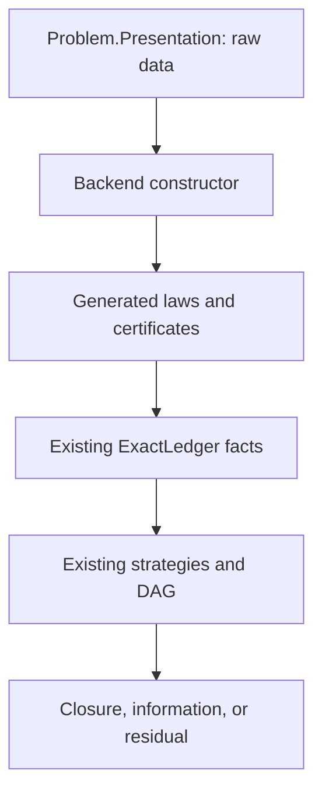

# PR 1 implementation plan: presentation-purity boundary

> Repository: [`FragileTech/hypostructure`](https://github.com/FragileTech/hypostructure)  
> Reference revision: [`4429f62523c96a7947541f9e3598a1243d4bd43e`](https://github.com/FragileTech/hypostructure/commit/4429f62523c96a7947541f9e3598a1243d4bd43e)  
> Proposed PR title: **Core: enforce proof-free problem presentations**  
> Status: implementation-ready design; Lean metaprogram API names should be confirmed against Lean 4.31 during coding

## 1. Executive decision

PR 1 should add a small compile-time purity checker at the existing `Core.Problem` / `Core.Provision` boundary. It must not add a new residual, fact store, runtime registry, executor, audit format, or Python source scanner.

The checker answers one question:

> Does this public presentation root contain only types, parameters, raw operators, predicates, and computations, or does it carry a proof/certificate that the backend is supposed to construct?

The implementation should expose one command:

```lean
#check_presentation_pure someProblemOrPresentationRoot
```

The command inspects a `Core.Problem`, a presentation value, or a presentation type. It succeeds silently when the root is pure and emits a deterministic field-path diagnostic when it finds proof-bearing content.

PR 1 is deliberately a boundary PR. It does not prove structural mathematics. It prevents later PRs from making the public presentation prove that mathematics on the backend's behalf.

## 2. Required outcome

After PR 1:

1. A `Core.Problem` whose `Presentation` is a proof-free record compiles under `#check_presentation_pure`.
2. A direct theorem field, a nested certificate, or a semantic-law package is rejected during elaboration.
3. Diagnostics identify the exact root, field path, field type, reason, and legal replacement pattern.
4. The existing `PrimitiveRole` vocabulary states which provision roles may describe public presentation inputs.
5. Positive and compile-failure fixtures run through the existing `lake build` path.
6. The current framework and Erdős builds remain green.
7. No low-level proof plumbing is duplicated.

The PR is not complete if it only checks `Problem.Presentation` and has no way to inspect supplementary values such as a domain adapter record. That would permit an application to keep a trivial `Problem.presentation` while passing proofs through an adjacent object.

## 3. Scope

### 3.1 In scope

- A Core-owned presentation-purity policy.
- A Lean command that inspects an arbitrary presentation root.
- Special handling for a term of type `Core.Problem`: inspect its projected `Presentation` type.
- Recursive inspection of user-defined structures and type constructors.
- Deterministic, stable diagnostics.
- Reuse of `Core.Provision.PrimitiveRole` for ownership classification.
- Positive and negative Lean fixtures using the repository's existing `#guard_msgs (error)` convention.
- Root imports so `lake build` exercises all fixtures.
- A short public API comment and usage example.

### 3.2 Explicitly out of scope

- Minimal-counterexample selection; that is PR 2.
- Local-response compilation, external types, or dependence extraction; those begin in PR 3.
- Moving or rewriting the Erdős spine proof.
- Introducing presentation facts into `ExactLedger`.
- A second provision registry.
- Persisted purity reports or JSON export.
- A Python regex gate over Lean source.
- A repository-wide policy that guesses which unregistered declarations are “presentation” from their filenames.
- Automatic rewriting of an illegal record into raw data plus backend theorems.

### 3.3 Why the PR stays small

Purity is an elaboration-time ownership check. It occurs before a branch exists, so it should not touch branch residuals, fact keys, manifests, atomic strategies, DAG compilation, routing, closure, or audit export. Reusing those systems here would be conceptually wrong as well as heavier.

## 4. Current repository baseline

The plan is anchored to the following live APIs.

| Existing component | Reuse in PR 1 | Required change |
| --- | --- | --- |
| [`Core/Problem.lean`](https://github.com/FragileTech/hypostructure/blob/4429f62523c96a7947541f9e3598a1243d4bd43e/hypostructure/Hypostructure/Core/Problem.lean) | Canonical public presentation carrier: `Problem.Presentation` and `Problem.presentation` | No representation change |
| [`Core/Provision.lean`](https://github.com/FragileTech/hypostructure/blob/4429f62523c96a7947541f9e3598a1243d4bd43e/hypostructure/Hypostructure/Core/Provision.lean) | Existing author/inferred/generated ownership vocabulary | Add presentation-safety classification to `PrimitiveRole` |
| [`Core/Prelude.lean`](https://github.com/FragileTech/hypostructure/blob/4429f62523c96a7947541f9e3598a1243d4bd43e/hypostructure/Hypostructure/Core/Prelude.lean) | Domain-independent import root | No change unless a metaprogram import proves necessary |
| [`Graph/Object.lean`](https://github.com/FragileTech/hypostructure/blob/4429f62523c96a7947541f9e3598a1243d4bd43e/hypostructure/Hypostructure/Graph/Object.lean) | `problemWithPresentation` already installs typed presentation data in `Core.Problem` | No change |
| [`Graph/ReceiverLoad.lean`](https://github.com/FragileTech/hypostructure/blob/4429f62523c96a7947541f9e3598a1243d4bd43e/hypostructure/Hypostructure/Graph/ReceiverLoad.lean) | Real proof-free presentation record for a positive regression | No change |
| [`Fixtures/ExactLedgerOpacity.lean`](https://github.com/FragileTech/hypostructure/blob/4429f62523c96a7947541f9e3598a1243d4bd43e/hypostructure/Hypostructure/Fixtures/ExactLedgerOpacity.lean) | Compile-failure fixture style | Copy the `#guard_msgs (error) in ...` pattern, not its ledger machinery |
| [`Fixtures/ExactExecutionMissingRequirement.lean`](https://github.com/FragileTech/hypostructure/blob/4429f62523c96a7947541f9e3598a1243d4bd43e/hypostructure/Hypostructure/Fixtures/ExactExecutionMissingRequirement.lean) | Exact diagnostic regression style | Reuse fixture convention only |
| [`Hypostructure.lean`](https://github.com/FragileTech/hypostructure/blob/4429f62523c96a7947541f9e3598a1243d4bd43e/hypostructure/Hypostructure.lean) | Framework build root and fixture aggregator | Import the checker and its fixtures |
| [`Makefile`](https://github.com/FragileTech/hypostructure/blob/4429f62523c96a7947541f9e3598a1243d4bd43e/Makefile) | Existing `framework-build`, `build`, `lint`, and `test` gates | No new target required |
| [`lakefile.toml`](https://github.com/FragileTech/hypostructure/blob/4429f62523c96a7947541f9e3598a1243d4bd43e/hypostructure/lakefile.toml) | Lean 4.31 / Mathlib build | No dependency change |

## 5. Important current-state finding

The current Erdős application has two different objects that its prose calls presentation data:

1. `problem.Presentation` is `Graph.ReceiverLoad.LoadCapacityProfile`. This record contains three `Nat` fields and is a valid public presentation.
2. `spineData : Graph.Strategy.Spine.Data` is a separate value in the application `Problem.lean`. It contains many proof fields, including `threshold_eq_three`, `three_le_threshold`, `freeForcesTarget`, `windowOrder_pos`, `routingLabelBound_eq`, `roleSafety`, and several certified barrier equalities.

The second object is not presentation-pure under the stated architecture. Its raw parameters may originate in the presentation, but its proof fields must be constructed in the graph/backend layer.

PR 1 should not silently certify the whole application merely because the formal `Core.Problem.presentation` projection is pure. For that reason the command must support arbitrary roots:

```lean
-- Must pass.
#check_presentation_pure HypostructureErdos64EG.problem
#check_presentation_pure HypostructureErdos64EG.erdosReceiverLoadProfile

-- Must report proof-bearing fields when run during migration.
#check_presentation_pure HypostructureErdos64EG.spineData
```

The last command should not be wired into the required application build in PR 1, because it is expected to fail until the later graph-adapter migration splits raw spine parameters from backend-produced certificates. PR 1 should record the diagnostic as a known migration input, not weaken the checker to make it pass.

## 6. Architectural rule established by PR 1

The canonical long-term path is:



PR 1 implements the guard on the first box. It does not implement boxes B–F.

The rule is:

> Public presentation types may describe objects and computations. They may not contain an inhabitant whose meaning is “the required theorem already holds.”

This permits a raw predicate such as `relation : α → α → Prop`: it defines which relation is being studied but supplies no proof that the relation has a useful property. It rejects a field such as `symmetric : ∀ x y, relation x y → relation y x`: that field discharges a semantic proof obligation.

## 7. Proposed file-level diff

| Path | Action | Approximate size | Purpose |
| --- | --- | ---: | --- |
| `Hypostructure/Core/Provision.lean` | Modify | 20–40 lines | Classify existing primitive roles as presentation-safe or backend-only |
| `Hypostructure/Core/PresentationPurity.lean` | Add | 250–400 lines | Policy, recursive type inspection, diagnostics, command elaborator |
| `Hypostructure/Fixtures/PresentationPurity.lean` | Add | 150–250 lines | Positive cases and exact negative diagnostics |
| `Hypostructure.lean` | Modify | 2–4 lines | Import checker and fixture into normal framework build |
| `README.md` or module docstring only | Optional | 10–20 lines | One usage example; prefer module documentation if README scope would expand |

No other file should be necessary. In particular, PR 1 should not modify `ExactLedger`, `FactManifest`, `ExactExecution`, routing, DAG compilation, graph strategy files, PDE files, application assembly, `quarantine.txt`, or the Makefile.

## 8. Reuse contract: what PR 1 must not rebuild

| Concern | Existing owner | PR 1 behavior |
| --- | --- | --- |
| Public problem data | `Core.Problem` | Inspect it; do not wrap it |
| Source ownership | `Core.Provision` | Extend its role predicates; do not add another role enum |
| Residual history | `Core.Residual.ExactLedger` | Not used |
| Fact publication | `FactSystem` / `FactManifest` | Not used; purity precedes fact generation |
| Execution | `AtomicCT`, `AtomicDecision`, strategy programs | Not used |
| Exhaustive topology | `Dag`, `ClosingProgram` | Not used |
| Runtime audit | Existing ledger/export data | Not used |
| Negative regression | `#guard_msgs (error)` fixtures | Reused directly |
| Build integration | `Hypostructure.lean`, `lake build`, Make targets | Reused directly |

This “not used” list is intentional. Reuse means selecting the correct existing boundary, not forcing every existing abstraction into every PR.

## 9. Public API design

### 9.1 Command syntax

The only new user-facing command should be:

```lean
#check_presentation_pure <term>
```

The command supports three input modes:

| Input | Example | Inspected root |
| --- | --- | --- |
| `Core.Problem` value | `#check_presentation_pure problem` | The reduced type `problem.Presentation` |
| Presentation value | `#check_presentation_pure loadProfile` | The inferred type of the value |
| Presentation type | `#check_presentation_pure LoadCapacityProfile` | The type expression itself when the term elaborates as a sort |

One command is preferable to separate `#check_problem_presentation_pure`, `#check_presentation_value_pure`, and `#check_presentation_type_pure` commands. The implementation can keep separate private normalization functions while preserving one public surface.

### 9.2 No public bypass attribute

PR 1 must not add a general application-usable attribute such as:

```lean
@[presentation_pure] structure MyCertificate ...
```

That would allow the presentation author to certify the very condition the backend is supposed to enforce. Any safe-head allowlist must be Core-owned and closed in PR 1. Adding a controlled extension protocol can be considered only after real cross-domain cases show it is necessary.

### 9.3 Provision role predicate

Extend the existing enum rather than creating `PresentationRole`:

```lean
namespace Hypostructure.Core

def PrimitiveRole.presentationSafe : PrimitiveRole → Bool
  | .definition
  | .operator
  | .finiteEnumeration
  | .decisionProcedure => true
  | .semanticLaw
  | .localCertificate
  | .importedContract => false

@[simp] theorem PrimitiveRole.semanticLaw_not_presentationSafe :
    PrimitiveRole.semanticLaw.presentationSafe = false := rfl

end Hypostructure.Core
```

The exact theorem set should be minimal: enough simp lemmas for fixtures and future provision auditing, not one theorem per constructor unless code uses them.

Here `finiteEnumeration` means raw ordered members or an executable enumerator; completeness and duplicate-freedom are still backend obligations. Likewise, `decisionProcedure` means a Boolean/computational decision interface; a stored proof of semantic correctness remains illegal. This interpretation keeps the existing role names while enforcing the stricter presentation boundary.

The distinction means that an external theorem may still be a legitimate author primitive at a theorem-application boundary. It simply cannot be hidden as a field of the public problem presentation. The backend/domain registration may consume it under `semanticLaw` or `importedContract` and publish generated consequences through the existing proof machinery.

## 10. Internal checker model

The checker is a Lean metaprogram, not mathematical runtime data. Its report types should remain private or live in a clearly metaprogram-only namespace.

Suggested internal vocabulary:

```lean
namespace Hypostructure.Core.PresentationPurity

private inductive FindingKind
  | propositionField
  | proofReturningFunction
  | forbiddenProofPackage
  | nestedImpureField
  | unsupportedOpaqueType
  deriving Repr, DecidableEq

private structure PathSegment where
  owner : Lean.Name
  field : Lean.Name

private structure Finding where
  root : Lean.Name
  path : List PathSegment
  fieldType : Lean.Expr
  kind : FindingKind
  replacement : String

end Hypostructure.Core.PresentationPurity
```

These objects are only used to collect and sort diagnostics during elaboration. They must not become a new persisted audit channel and must not be stored in `Problem`.

## 11. Purity policy

### 11.1 Allowed content

| Shape | Example | Reason |
| --- | --- | --- |
| Scalar parameters | `Nat`, `Int`, `Bool`, `String` | Raw data |
| Finite intrinsic indices | `Fin n`, tuples of finite indices | Data with an intrinsic representation invariant |
| Ordinary containers | `List α`, `Array α`, `Option α`, `α × β`, `Sum α β` | Pure if their elements are pure |
| Raw operators | `α → β`, `α → β → γ` | Computation, if result types are pure |
| Predicate definitions | `α → Prop`, `α → β → Prop` | Names a relation but contains no proof of a relation instance |
| Boolean tests | `α → Bool` | Preferred executable public relation |
| Type parameters | `Carrier : Type u` | Describes the presented carrier |
| Proof-free user records | `LoadCapacityProfile` | Recursively pure fields |
| Problem with no presentation | default `PUnit` | Existing source-compatible default |

### 11.2 Rejected content

| Shape | Example | Reason / backend owner |
| --- | --- | --- |
| Direct proposition field | `positive : 0 < n` | Presentation supplies a proof |
| Theorem-valued function | `law : ∀ x, R x → S x` | Semantic law belongs to backend/domain theorem registration |
| Existence witness | `witness : ∃ x, R x` | Certified existence |
| Nonemptiness witness | `member : Nonempty α` | Proof package |
| Equivalence package | `equiv : α ≃ β` | Contains inverse laws |
| Semantic equivalence | `Core.SemanticEquivalence P` | Backend reconstruction/invariance theorem |
| Target invariance | `Core.TargetInvariant E Target` | Backend target-transport theorem |
| Minimal-counterexample context | `MinimalCounterexampleContext ...` | Backend minimal selection result |
| Closure evidence | `ClosureEvidence` or closure result | Generated branch closure |
| Complete/certified schedule | complete enumeration or certified table | Backend must prove coverage/certification from raw schedules/tables |
| Generic subtype witness | `{x // R x}` | Hidden proof, except a small Core-owned intrinsic allowlist such as `Fin` |
| Framework certificate structures | structural, normalization, resource, or residual certificates | Generated backend output |
| Provision entry | `AuthorPrimitiveRef`, `Provision.Entry` | Audit metadata belongs to provision/audit, not public mathematical data |

### 11.3 Strictness choice for PR 1

The checker should be strict on semantic proofs and conservative on unknown opaque types:

- Known ordinary inductives are traversed through their parameters and constructor fields.
- User structures are traversed through their fields.
- Reducible aliases are unfolded.
- A small Core-owned safe-leaf set handles intrinsic encodings whose proof fields are representation details, initially `Fin` and any other type required by the positive fixtures.
- Unknown opaque structures are not silently accepted. They produce `unsupportedOpaqueType` with a diagnostic asking the author to expose a proof-free data view.

Do not begin with a large allowlist. Every allowlisted type becomes part of the security boundary.

## 12. Recursive inspection algorithm

### 12.1 Root normalization

Given the command term:

1. Elaborate it in command context.
2. Infer its type.
3. If its inferred type is definitionally `Core.Problem`, construct and weak-head-normalize the projection `Problem.Presentation term`.
4. Else, if the term itself elaborates as a type, inspect the term.
5. Else inspect the inferred type of the value.
6. Record the root declaration name when available; use the syntax location otherwise.

The command must inspect the presentation *type*, not merely the `Option` stored in `Problem.presentation`. A problem with `presentation := none` but a proof-bearing declared `Presentation` type is still an illegal boundary design.

### 12.2 Visitor state

Maintain:

- a stack of field-path segments;
- a visited set keyed by normalized head declaration plus instantiated parameters;
- a recursion-depth limit with a clear diagnostic;
- a deterministic list of findings;
- a cache from normalized type expression to purity result.

The cache avoids repeatedly traversing common container and parameter types. The visited set prevents recursive structures from looping.

### 12.3 Type visitor order

For each normalized type expression:

1. If `Meta.isProp` reports that the expression itself is a proposition, emit `propositionField`.
2. If the expression is a sort, metavariable-free type parameter, or known scalar, accept it.
3. If it is a `forallE`/function type:
   - inspect the domain as data;
   - enter a local binder;
   - inspect the body;
   - distinguish `α → Prop` (predicate-valued data) from `∀ x, R x` (a proof). The latter is caught because the instantiated body is itself a proposition.
4. Reduce transparent/reducible aliases once and revisit.
5. If the head is in the forbidden package set, emit `forbiddenProofPackage` without expanding it.
6. If the head is in the Core-owned intrinsic safe set, inspect only its data parameters and stop.
7. If the head is a structure, obtain its field declarations, instantiate parameters, and recursively inspect every field type in source order.
8. If the head is a non-structure inductive, inspect parameters and constructor argument types. Reject proof arguments unless the head is an approved intrinsic encoding.
9. If no sound inspection path exists, emit `unsupportedOpaqueType` instead of accepting by default.

### 12.4 Why source-order traversal matters

Diagnostics should follow declaration order. A stable first failure makes `#guard_msgs` fixtures reliable and gives authors a predictable repair sequence. If all findings are displayed, sort them by rendered field path, never by hash-map iteration order.

### 12.5 Value bodies are not proof-audited

PR 1 should inspect types, not arbitrary definition bodies. A `Nat` computed using a theorem internally still exposes only a `Nat`; no downstream proof obligation is discharged by possessing it. Auditing theorem provenance is the job of `Core.Provision` and later backend registrations.

The boundary becomes illegal when the output type contains the proof/certificate itself.

## 13. Diagnostic contract

Diagnostics are part of the PR's API because compile-failure fixtures and application authors depend on them.

Required format:

```text
error: public presentation is not proof-free
root: BadPresentation
path: BadPresentation.windowBarrier.flatPositive
field type: 0 < barrier.flatCount
reason: proposition-valued field supplies a proof owned by the backend
replacement: keep the raw table/count in the presentation and derive this fact in Core or the domain backend
```

Requirements:

- Begin with one stable headline.
- Print the complete dotted path.
- Pretty-print the offending type with normal Lean formatting.
- Name the ownership reason, not merely “unsupported type.”
- Provide one actionable replacement pattern.
- Do not dump internal expressions, metavariable IDs, or traversal state.
- If several findings exist, either print the first deterministic finding or a bounded deterministic list. PR 1 should prefer the first finding to keep diagnostics focused and fixtures stable.

Suggested replacement messages:

| Finding | Replacement message |
| --- | --- |
| Direct proposition | “Keep the raw operands in the presentation; prove this proposition in Core/domain backend.” |
| Semantic law | “Register the law as a backend `semanticLaw`/`importedContract`; do not store its proof in the presentation.” |
| Complete enumeration | “Present the raw ordered values; construct and prove completeness in the backend.” |
| Certified table | “Present raw rows or a Boolean table; generate the certificate in the backend.” |
| Equivalence/reconstruction | “Present the forward/backward operators; prove inverse and invariance laws in the backend.” |

## 14. Fixture plan

All fixtures should live in one module unless diagnostic size makes two modules clearer:

```text
Hypostructure/Fixtures/PresentationPurity.lean
```

The module imports `Core.PresentationPurity` and uses the same `#guard_msgs (error)` pattern as the exact-ledger negative fixtures.

### 14.1 Positive fixtures

| ID | Fixture | Expected result |
| --- | --- | --- |
| P1 | `Core.Problem` with default `PUnit` presentation | Pass |
| P2 | Record of three `Nat` parameters mirroring `LoadCapacityProfile` | Pass |
| P3 | Record containing `Bool`, `Fin n`, `List Nat`, `Option Nat`, products | Pass |
| P4 | Record containing `test : α → Bool` | Pass |
| P5 | Record containing `relation : α → α → Prop` and no law | Pass |
| P6 | Record containing a raw operator `step : State → Input → State` | Pass |
| P7 | `Graph.ReceiverLoad.LoadCapacityProfile` or an equivalent Core-local fixture | Pass; prefer the real type if import layering remains acceptable |
| P8 | A `Core.Problem` installed through existing `problemWithPresentation` | Pass |

### 14.2 Negative fixtures

| ID | Illegal field | Expected diagnostic kind |
| --- | --- | --- |
| N1 | `positive : 0 < threshold` | `propositionField` |
| N2 | `law : ∀ x, relation x x` | `proofReturningFunction` / proposition field |
| N3 | Nested record whose inner record has a theorem field | Complete nested path |
| N4 | `witness : ∃ x, relation x` | Forbidden proof package |
| N5 | `nonempty : Nonempty Carrier` | Proposition field |
| N6 | `equiv : α ≃ β` | Forbidden proof package or nested inverse-law path |
| N7 | `semantics : Core.SemanticEquivalence P` | Backend semantic certificate |
| N8 | `context : MinimalCounterexampleContext ...` | Backend selection certificate |
| N9 | `complete : CompleteEnumeration α` | Backend completeness certificate |
| N10 | Generic `Subtype` carrying a semantic predicate | Hidden proof package |
| N11 | `Provision.Entry` or `AuthorPrimitiveRef` in the mathematical presentation | Wrong channel |
| N12 | Opaque unknown carrier that cannot be inspected | Fail closed with `unsupportedOpaqueType` |

### 14.3 Diagnostic regression example

```lean
structure BadPresentation where
  threshold : Nat
  threshold_pos : 0 < threshold

def bad : BadPresentation := ⟨1, by decide⟩

/--
error: public presentation is not proof-free
root: BadPresentation
path: BadPresentation.threshold_pos
field type: 0 < threshold
reason: proposition-valued field supplies a proof owned by the backend
replacement: keep the raw operands in the presentation and prove this proposition in Core or the domain backend
-/
#guard_msgs (error) in
#check_presentation_pure bad
```

Use the final Lean 4.31 pretty-printer output in the fixture comment; do not guess the exact text before running the file.

### 14.4 Provision classification fixtures

Add small `example` or `by decide` checks showing:

```lean
example : PrimitiveRole.definition.presentationSafe = true := rfl
example : PrimitiveRole.operator.presentationSafe = true := rfl
example : PrimitiveRole.semanticLaw.presentationSafe = false := rfl
example : PrimitiveRole.localCertificate.presentationSafe = false := rfl
example : PrimitiveRole.importedContract.presentationSafe = false := rfl
```

These are ordinary positive fixtures, not a new test harness.

## 15. Erdős migration audit in PR 1

PR 1 should include a maintainer-run audit note in its description, not a new framework dependency on the application package.

Run from the Erdős package in a temporary probe file:

```lean
import Hypostructure.Core.PresentationPurity
import HypostructureErdos64EG.Problem

#check_presentation_pure HypostructureErdos64EG.problem
#check_presentation_pure HypostructureErdos64EG.erdosReceiverLoadProfile

-- Expected to fail until the graph-adapter migration:
#check_presentation_pure HypostructureErdos64EG.spineData
```

Expected interpretation:

- The first two successes validate the canonical raw presentation.
- The third failure proves that the checker detects the current supplementary proof bundle.
- The third failure is not fixed in PR 1 by adding an allowlist entry.
- Later migration splits `Spine.Data` into a raw input view and a backend-generated certificate view.

This is the most important anti-gaming regression for the checker.

## 16. Implementation sequence

### Step 1 — Add the role predicate in `Provision.lean`

1. Define `PrimitiveRole.presentationSafe` by exhaustive pattern match.
2. Add only the simp lemmas used by fixtures or checker messages.
3. Preserve every existing constructor and serialized spelling.
4. Do not change `Provision.Entry` or its author/generated separation.
5. Run the existing framework build before introducing metaprogram code.

Exit condition: no behavior change outside the new pure predicate.

### Step 2 — Create `Core/PresentationPurity.lean`

1. Import `Core.Problem` and `Core.Provision`.
2. Import the narrow Lean elaborator/meta modules required by Lean 4.31; do not broaden `Core.Prelude` unless multiple Core metaprograms will share them.
3. Define private policy constants and diagnostic vocabulary.
4. Implement root normalization.
5. Implement the recursive visitor with caching and cycle protection.
6. Implement deterministic rendering.
7. Register the `#check_presentation_pure` command.
8. Add module documentation stating that this is a compile-time ownership check, not a theorem and not a runtime audit.

Exit condition: a local scratch example accepts a pure scalar record and rejects a direct theorem field.

### Step 3 — Add container and nested-structure handling

1. Add standard scalar/container cases.
2. Add the minimal intrinsic safe-head set.
3. Verify that `Fin n` passes without allowing generic semantic `Subtype` packages.
4. Verify that recursive structures terminate.
5. Verify that a predicate field passes while a theorem about the predicate fails.
6. Verify that unknown opaque heads fail closed.

Exit condition: the policy table in Section 11 matches actual command behavior.

### Step 4 — Add fixtures

1. Add all positive cases.
2. Add direct, nested, package, and opaque negative cases.
3. Capture actual Lean diagnostics in `#guard_msgs` comments.
4. Add provision-role examples.
5. Keep fixture names semantic; do not number them after proof nodes.

Exit condition: direct execution of the fixture module succeeds because every expected error is captured.

### Step 5 — Wire into the normal build

Add:

```lean
import Hypostructure.Core.PresentationPurity
import Hypostructure.Fixtures.PresentationPurity
```

to the existing framework root in the appropriate Core/fixture sections.

Do not add a custom Lake target. The repository already treats root-imported fixtures as build checks.

Exit condition: `lake build` checks the command and every fixture.

### Step 6 — Run the application audit probes

1. Confirm the real `LoadCapacityProfile` passes.
2. Confirm the registered Erdős `problem` passes.
3. Confirm `spineData` fails on a proof field.
4. Record the first failing field path in the PR description as the starting point for the later split.
5. Do not weaken policy or move graph code in this PR.

Exit condition: the checker distinguishes the pure canonical presentation from the proof-bearing supplementary record.

## 17. Build and verification commands

Run the narrow checks first:

```bash
cd hypostructure
lake env lean Hypostructure/Fixtures/PresentationPurity.lean
lake build
```

Then run the repository gates from the root:

```bash
make framework-build
make lint
make build
make test
```

`make lint` should continue using the existing total-execution and canonical-ledger gates. PR 1 should not add presentation-purity logic to those Python scripts.

The final PR report should include:

- Lean version (`v4.31.0`).
- `lake build` result.
- `make lint` result.
- `make test` result.
- Number of positive purity fixtures.
- Number of captured negative purity fixtures.
- Result of the three Erdős audit probes.

## 18. Acceptance criteria

### 18.1 Functional

- [ ] `#check_presentation_pure` accepts a `Core.Problem` term.
- [ ] It accepts an arbitrary presentation value.
- [ ] It accepts a presentation type.
- [ ] It checks `Problem.Presentation`, not merely `Problem.presentation.isSome`.
- [ ] It traverses nested user records.
- [ ] It handles recursive types without looping.
- [ ] It distinguishes predicate definitions from theorem fields.
- [ ] It rejects direct and nested proof packages.
- [ ] It fails closed on unsupported opaque types.
- [ ] Diagnostics contain a stable field path and repair instruction.

### 18.2 Architectural

- [ ] No new residual or branch-state carrier.
- [ ] No new fact store or fact key system.
- [ ] No new executor, router, DAG, or closure type.
- [ ] No persisted audit/report format.
- [ ] No user-controlled purity bypass attribute.
- [ ] `PrimitiveRole` remains the sole provision role taxonomy.
- [ ] `Problem.Presentation` remains the canonical public carrier.
- [ ] Supplementary roots can be checked explicitly.

### 18.3 Regression

- [ ] Default `PUnit` presentation passes.
- [ ] `LoadCapacityProfile` passes.
- [ ] A direct theorem field fails.
- [ ] A nested theorem field fails with the full path.
- [ ] A semantic-equivalence package fails.
- [ ] A minimal-counterexample certificate fails.
- [ ] A raw predicate field passes.
- [ ] The current `spineData` audit fails, demonstrating the intended later migration.
- [ ] Existing framework and application tests remain green.
- [ ] No `sorry` or `admit` is introduced.

## 19. Risks and mitigations

| Risk | Failure mode | Mitigation in PR 1 |
| --- | --- | --- |
| Checker is too shallow | Adjacent record hides proofs | Recursive field/constructor traversal and nested fixture |
| Checker is too broad | Ordinary encoded data such as `Fin` is rejected | Very small Core-owned intrinsic safe set with positive fixtures |
| Checker is gameable | Application marks a certificate “safe” | No public bypass attribute or application allowlist |
| Diagnostic instability | `#guard_msgs` breaks after unrelated changes | Source-order traversal, first deterministic finding, bounded pretty-printing |
| Infinite recursion | Recursive presentation type loops | Visited set plus depth limit |
| Excessive elaboration cost | Large types expand repeatedly | Normalized-type cache and safe opaque scalar/container heads |
| Meta API churn | Lean 4.31 names differ from sketch | Keep metaprogram isolated in one file; verify with targeted fixture first |
| False confidence | Canonical presentation passes while supplementary proof record remains | Generic root mode and explicit `spineData` migration audit |
| Scope expansion | PR starts moving the entire graph spine | Record failure only; defer split to adapter migration |
| Duplicate auditing | New JSON or Python report diverges from provision/export | Diagnostics remain compile-time only; reuse existing build root |

## 20. Review guide

Reviewers should read the PR in this order:

1. `PrimitiveRole.presentationSafe`: verify ownership policy.
2. Positive/negative fixture declarations: verify the intended boundary before reading metaprogram internals.
3. Root normalization: verify that a `Core.Problem` checks the projected presentation type.
4. Direct proposition detection.
5. Nested structure/constructor traversal.
6. Safe and forbidden head sets.
7. Diagnostic determinism.
8. `Hypostructure.lean` imports.
9. Erdős audit probe results.

Questions every reviewer should answer:

- Can an application put a proof in a nested record and pass?
- Can an application bypass the policy with an attribute?
- Does `α → Prop` pass while `∀ x, R x` fails for the right reason?
- Does the checker accidentally inspect `Baseline` or `Target` as if they were presentation fields?
- Does the implementation import Graph or PDE into Core?
- Does it add any storage or execution mechanism?
- Would an illegal certified table be rejected without special-casing its application name?
- Does the current `spineData` probe demonstrate the policy rather than force an exception?

## 21. Proposed PR description

```markdown
## Summary

Adds `#check_presentation_pure`, a Core-owned elaboration command that rejects
proof- and certificate-bearing public problem presentations. The checker works
on `Core.Problem`, presentation values, and presentation types, recursively
reports the first illegal field path, and reuses the existing `PrimitiveRole`
ownership vocabulary.

## Why

The structural-exhaustion backend must derive minimality, completeness,
normalization, reconstruction, resource, pumping, and closure facts from raw
problem data. Allowing those proofs as presentation fields would make later
generic theorems circular.

## Reuse

- `Core.Problem` remains the sole typed presentation carrier.
- `Core.Provision` remains the sole ownership taxonomy.
- Existing `#guard_msgs` fixtures provide negative regression tests.
- Existing `lake build` / Make targets run the checker.
- No ledger, fact, executor, routing, DAG, or audit machinery is added.

## Migration note

The registered Erdős `LoadCapacityProfile` passes. The current supplementary
`spineData` record is intentionally reported as proof-bearing; splitting its
raw fields from backend certificates is deferred to the graph-adapter
migration and is not bypassed here.

## Verification

- [ ] `lake build`
- [ ] `make lint`
- [ ] `make test`
- [ ] positive purity fixtures
- [ ] captured negative diagnostics
- [ ] Erdős problem/profile pass; `spineData` migration probe fails as expected
```

## 22. Definition of done

PR 1 is done when a maintainer can point `#check_presentation_pure` at any claimed presentation root and receive one of two trustworthy outcomes:

- success, meaning the exposed type contains only public data/computation under the closed PR 1 policy; or
- a precise error identifying a proof/certificate that must move behind the backend boundary.

The PR must leave the framework with exactly the same runtime plumbing it had before. Its contribution is a hard compile-time ownership boundary that every later structural engine can rely on.

## 23. Contract handed to later PRs

PRs 2–10 may assume:

1. Public presentation roots are inspectable with a single standard command.
2. Minimality, completeness, semantic equivalence, reconstruction, certified enumeration, resource inequalities, pumping conclusions, and closure evidence cannot legally arrive as presentation fields.
3. Raw data needed to prove those facts can still be exposed as scalars, carriers, operators, predicates, Boolean tests, and proof-free records.
4. Generated theorems must enter the existing `Provision` / exact-fact / strategy stack rather than being added back to the presentation.

That is the entire purpose of PR 1: make the input boundary honest before building the reusable theorem machinery on top of it.
