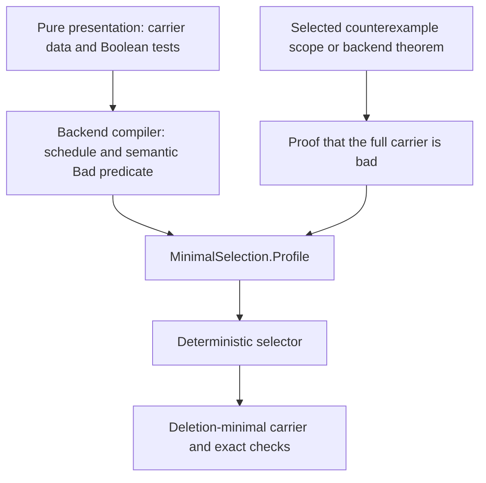
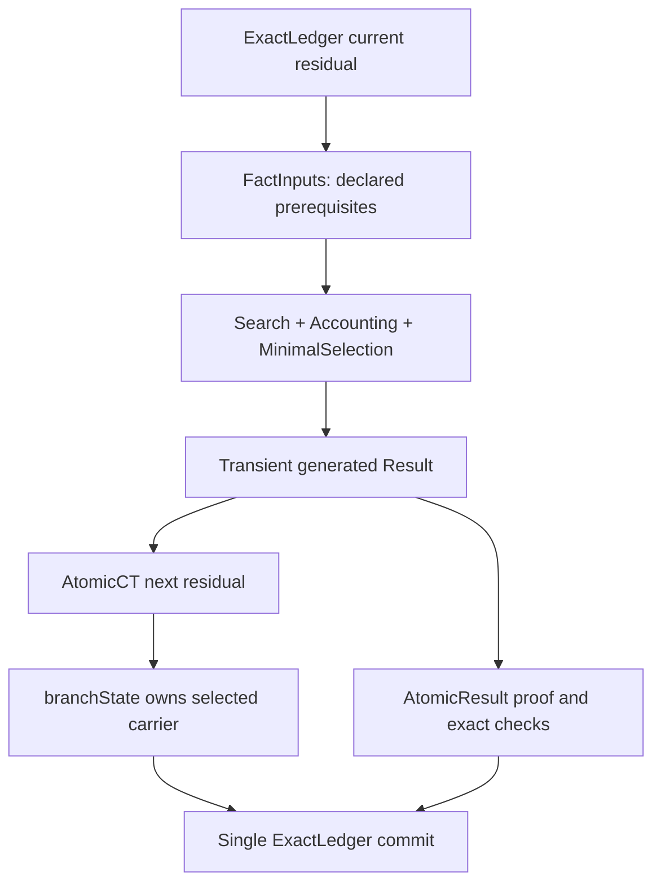
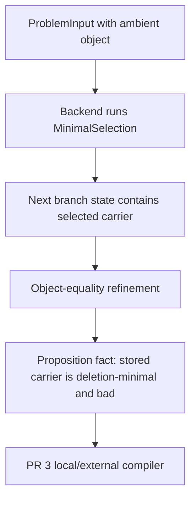
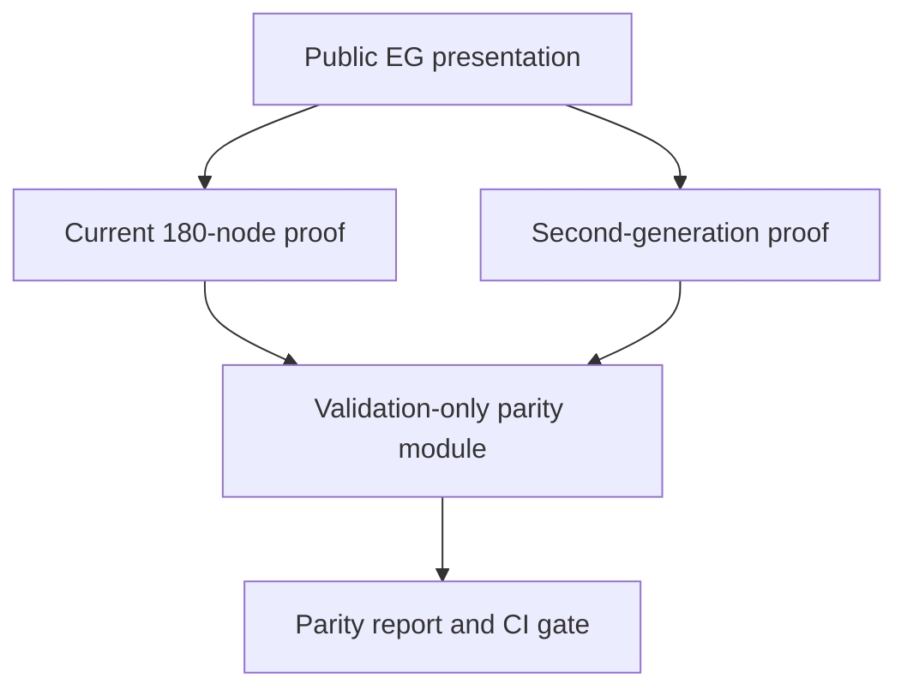

# PR 2 implementation plan: minimal selection with exact accounting

> Repository: [`FragileTech/hypostructure`](https://github.com/FragileTech/hypostructure)  
> Inspected reference revision: [`4429f62523c96a7947541f9e3598a1243d4bd43e`](https://github.com/FragileTech/hypostructure/commit/4429f62523c96a7947541f9e3598a1243d4bd43e)  
> Assumed base: the reference architecture plus a correctly implemented and merged PR 1 presentation-purity boundary  
> Proposed PR title: **Core: commit deterministic deletion-minimal selection with exact ledger accounting**  
> Status: implementation-ready design; exact Lean syntax should be confirmed against Lean 4.31 while coding

## 1. Executive decision

PR 2 should implement one problem-agnostic backend engine:

> Given a deterministic finite schedule, a decidable predicate saying that a retained carrier is bad, and a backend proof that the full scheduled carrier is bad, repeatedly delete the first item whose deletion preserves badness. Return the final bad carrier, prove that no one-item deletion remains bad, and count every candidate-deletion test exactly.

The executable guarantee must be named **deletion-minimality**, not unconditional inclusion-minimality. For an arbitrary non-monotone badness predicate, these are different notions. PR 2 should also provide two rigorous bridges:

1. deletion-minimality implies inclusion-minimality when badness is explicitly upward closed; and
2. the existing noncomputable `Core.Finite.EssentialCarrier` construction supplies a genuinely minimum-cardinality bad carrier when that stronger global conclusion is required.

The implementation should reuse the existing finite stack:

- `Core.Finite.Enumeration` for exact ordered schedules;
- the reusable portion of the currently quarantined `Core.Finite.Search` for deterministic first-hit scans;
- the currently quarantined `Core.Finite.Accounting` for exact scan counts;
- `Core.Counted` for exact sequential addition;
- `Core.PolynomialCheckBudget` for the quadratic envelope; and
- `Core.Finite.EssentialCarrier` for the global minimum-cardinality bridge.

PR 2 must not add another enumeration, search result, counter, work ledger, residual, fact store, executor, or minimal-counterexample scope.

It must also include the **canonical execution handoff** required by the
single-source architecture. `Search`, `Accounting`, and `MinimalSelection` are
pure theorem-producing computations; they are not alternative state carriers.
Their output may exist transiently while one `AtomicCT` executes, but the
selected carrier used by every later stage must be written exactly once into
the current `ProblemInput.branchState`. The same atomic commit publishes a
subsingleton proposition stating that this residual-owned carrier is the
verified selection and records the exact checks in the sole `ExactLedger`
audit. No downstream strategy may accept the free-floating `Result` as a second
source of truth.

PR 2 must also establish the **Erdős–Gyárfás golden-proof parity harness**.
The current complete 180-node implementation is the regression oracle for the
second-generation proof. The harness must keep the current proof compiling,
derive the canonical node set from the repository's existing proof graph and
node audit, and require a machine-checked bridge from every covered
second-generation fact back to the corresponding current node statement. The
current proof is validation input only: no production second-generation module
may import its final theorem, its assembly, or its proof producers.

## 2. What PR 2 proves

For a finite schedule `schedule : Enumeration Item`, write

```lean
U := schedule.toFinset
```

and let `Bad : Finset Item → Prop` be decidable. Assuming the backend proves `Bad U`, the executable selector returns `C ⊆ U` with:

```lean
Bad C
```

and

```lean
∀ x ∈ C, ¬ Bad (C.erase x).
```

It also returns the deterministic deletion order and an exact number of primitive candidate-deletion tests. If `n = schedule.card`, the exact count is proved to satisfy:

```lean
checks ≤ n * (n + 1).
```

No graph, path, cycle, PDE, scale, energy, target, or Erdős–Gyárfás concept appears in this theorem.

## 3. The PR 1 assumption and proof ownership

PR 1 is assumed to enforce that public presentations contain only raw data and computations. Consequently, PR 2 must preserve this ownership chain:



The internal `MinimalSelection.Profile` is allowed to contain proofs because it is a backend theorem input, not a public problem presentation. PR 2 must never ask the public presentation to provide:

- schedule duplicate-freedom;
- schedule completeness;
- the proposition `Bad U`;
- correctness of a Boolean predicate;
- termination;
- minimality;
- determinism; or
- the work bound.

Those obligations are constructed or proved behind the purity boundary.

## 4. Required outcome

After PR 2:

1. `Core.Finite.Search` is a live, pure finite module rather than a quarantined module tied to a deleted residual API.
2. `Core.Finite.Accounting` is live and supplies the canonical exact count for every search execution.
3. `Core.Finite.MinimalSelection` exposes a generic backend `Profile`, executable `run`, and a sealed result.
4. The result proves badness, containment in the scheduled universe, and one-deletion minimality.
5. The deletion order is deterministic for a fixed schedule and predicate.
6. `run` returns the existing `Counted` type and its `checks` field is the exact sum of the canonical first-hit scan counts.
7. A degree-two `PolynomialCheckBudget` proves the uniform `n(n+1)` envelope.
8. A theorem explicitly states the additional monotonicity assumption needed to upgrade deletion-minimality to inclusion-minimality.
9. A bridge reuses `EssentialCarrier` to obtain a minimum-cardinality bad subset of the scheduled universe.
10. Positive, edge-case, counterexample, exact-count, determinism, and constructor-opacity fixtures run under the normal build.
11. No public presentation acquires a proof field.
12. A canonical atomic selection stage writes the selected carrier into the existing `ProblemInput.branchState` and appends its verification fact to the sole `ExactLedger`.
13. The fact value is a subsingleton proposition about the carrier already stored in the residual; the fact does not carry the `Finset`.
14. `AtomicResult.checks` is exactly `(MinimalSelection.run profile).checks`, so the canonical ledger audit records the same computation that chose the carrier.
15. Downstream stages read the carrier from `FactInputs.current.branchState` after requiring the selection fact; they cannot consume a parallel `Result` value.
16. The current complete 180-node Erdős–Gyárfás proof remains green and is registered as the golden regression corpus for the second-generation proof.
17. The canonical node set is read from existing EG annotations, audit tables, and proof-graph extraction; PR 2 does not create a second node registry.
18. Every node claimed as covered has a Lean bridge proving that the new fact is definitionally equal to, exactly implies, or rigorously strengthens the current node statement in the same branch context.
19. A dedicated validation module may import both implementations, but production second-generation modules are rejected if they import the current `Assembly`, current producers, the parity module, or the current final theorem.
20. A single `make erdos-parity` gate runs endpoint, node, branch, ledger, dependency, and axiom checks and reports covered and pending nodes without treating validation metadata as runtime proof state.

## 5. Scope

### 5.1 In scope

- Rehabilitation of the pure search portion of `Core/Finite/Search.lean`.
- Rehabilitation of `Core/Finite/Accounting.lean`.
- Removal of exactly those two modules from `quarantine.txt` after they compile against live Core.
- Definitions distinguishing deletion-minimal, inclusion-minimal, and minimum-cardinality bad carriers.
- A deterministic first-deletable-item loop.
- Kernel proofs of badness preservation, containment, termination, deletion-minimality, and deterministic output.
- Exact check accumulation through `Counted.bind`.
- A quadratic `PolynomialCheckBudget` and a theorem placing the exact run count within it.
- A noncomputable minimum-cardinality bridge built from the existing `EssentialCarrier.Profile`.
- A reusable selection slot/contract for storing one verified selection in an existing problem branch state.
- A sealed `AtomicCT` constructor that computes, stores, proves, and audits the selection in one commit.
- A canonical-ledger fixture proving that residual data, fact meaning, and audit checks agree.
- Extension of the existing EG node audit with second-generation declaration, bridge, and parity-status columns.
- A validation-only Lean module containing node bridges and endpoint checks.
- A thin parity checker that joins the existing node audit, `EG-NODE` annotations, extracted proof graph, and Lean bridge inventory.
- An aggregate `erdos-parity` Make target that runs the current proof and all parity gates.
- Synthetic Core fixtures, including a counterexample showing that deletion-minimality alone is not inclusion-minimality.
- Root imports so the standard framework build exercises the modules and fixtures.

### 5.2 Explicitly out of scope

- Raw local-response tables and external signatures; those are PR 3.
- Dependence extraction and interface replacement; those are PR 4.
- Structural normal-form classification; that is PR 5.
- Resource amplification or classwise overload; that is PR 6.
- Weighted pumping; that is PR 7.
- The full standard structural fact-key bundle, later structural atomic stages, DAG routing, or canonical export; those remain PR 8.
- A second residual domain or a wrapper ledger around `ProblemInput`.
- Publishing the carrier, deletion order, schedule, or search execution inside a fact value.
- Graph or PDE adapters.
- Completing or switching the public entry point to the second-generation Erdős proof; PR 2 installs the validation harness and records the coverage available at this layer.
- Changing `MinimalCounterexampleScope`.
- Replacing the ambient `ProblemInput.object` with the selected restriction.
- Adding a data-bearing ledger fact.
- Reviving `Core.Finite.SelectedSchedule`, `Core.Finite.Flatten`, or any unrelated quarantined module.
- Claiming global inclusion-minimality without an explicit hypothesis that makes the claim true.

## 6. Current repository baseline

The implementation is anchored to these live or quarantined APIs at the inspected revision.

| Existing component | Current state | PR 2 disposition |
| --- | --- | --- |
| [`Core/Finite/Enumeration.lean`](https://github.com/FragileTech/hypostructure/blob/4429f62523c96a7947541f9e3598a1243d4bd43e/hypostructure/Hypostructure/Core/Finite/Enumeration.lean) | Live; ordered duplicate-free schedules, `toFinset`, `subtype`, products, dependent flattening | Reuse as the only finite schedule representation |
| [`Core/Finite/Search.lean`](https://github.com/FragileTech/hypostructure/blob/4429f62523c96a7947541f9e3598a1243d4bd43e/hypostructure/Hypostructure/Core/Finite/Search.lean) | Quarantined; pure first-hit engine plus stale residual-routing tail | Port in place, remove stale routing dependency, then make live |
| [`Core/Finite/Accounting.lean`](https://github.com/FragileTech/hypostructure/blob/4429f62523c96a7947541f9e3598a1243d4bd43e/hypostructure/Hypostructure/Core/Finite/Accounting.lean) | Quarantined; exact first-hit counts and `countedRun` | Compile against rescued Search, then make live |
| [`Core/Budget/Work.lean`](https://github.com/FragileTech/hypostructure/blob/4429f62523c96a7947541f9e3598a1243d4bd43e/hypostructure/Hypostructure/Core/Budget/Work.lean) | Live; `PolynomialCheckBudget`, `Within`, `Counted`, `bind`, `zip` | Reuse unchanged |
| [`Core/Finite/EssentialCarrier.lean`](https://github.com/FragileTech/hypostructure/blob/4429f62523c96a7947541f9e3598a1243d4bd43e/hypostructure/Hypostructure/Core/Finite/EssentialCarrier.lean) | Live; noncomputable minimum-cardinality carrier and erase-essentiality | Reuse through an adapter; do not duplicate |
| [`Core/Finite/MaximalSelection.lean`](https://github.com/FragileTech/hypostructure/blob/4429f62523c96a7947541f9e3598a1243d4bd43e/hypostructure/Hypostructure/Core/Finite/MaximalSelection.lean) | Live; domain-neutral selection naming and work-bound pattern | Reuse conventions, not its conflict-specific result type |
| [`Core/Strategy/MinimalCounterexampleScope.lean`](https://github.com/FragileTech/hypostructure/blob/4429f62523c96a7947541f9e3598a1243d4bd43e/hypostructure/Hypostructure/Core/Strategy/MinimalCounterexampleScope.lean) | Live; selects the ambient minimal counterexample | Leave unchanged; PR 2 operates inside that object |
| [`Core/Residual/ExactLedger.lean`](https://github.com/FragileTech/hypostructure/blob/4429f62523c96a7947541f9e3598a1243d4bd43e/hypostructure/Hypostructure/Core/Residual/ExactLedger.lean) | Live; canonical ledger, fact values are subsingletons | Do not use it to carry selected data |
| [`Core/Strategy/ProblemResidual.lean`](https://github.com/FragileTech/hypostructure/blob/4429f62523c96a7947541f9e3598a1243d4bd43e/hypostructure/Hypostructure/Core/Strategy/ProblemResidual.lean) | Live; refinements preserve object identity and facts carry no data | Leave unchanged; document later adapter handoff |
| [`Core/Strategy/ExactExecution.lean`](https://github.com/FragileTech/hypostructure/blob/4429f62523c96a7947541f9e3598a1243d4bd43e/hypostructure/Hypostructure/Core/Strategy/ExactExecution.lean) | Live; `AtomicCT` refines the residual and `AtomicResult.checks`/`.work` commit audit metadata | Reuse now for the canonical selection commit |
| [`Core/Strategy/ProblemInput.lean`](https://github.com/FragileTech/hypostructure/blob/4429f62523c96a7947541f9e3598a1243d4bd43e/hypostructure/Hypostructure/Core/Strategy/ProblemInput.lean) | Live; sole object, baseline, and dependent branch state | Store selection data in its existing branch state through a registered slot |
| [`Hypostructure.lean`](https://github.com/FragileTech/hypostructure/blob/4429f62523c96a7947541f9e3598a1243d4bd43e/hypostructure/Hypostructure.lean) | Live build root | Import rescued modules, selector, and fixtures |
| [`quarantine.txt`](https://github.com/FragileTech/hypostructure/blob/4429f62523c96a7947541f9e3598a1243d4bd43e/hypostructure/quarantine.txt) | Lists Search, Accounting, SelectedSchedule, Flatten, and legacy modules | Remove Search and Accounting only after the port passes |

## 7. Critical current-state findings

### 7.1 `Search` is mostly reusable, but not live as written

The current `Search.lean` already contains the right pure machinery:

- `IndexedHit` with an exact `Fin schedule.card` index;
- proof that the hit satisfies the predicate;
- proof that the exact prefix has no earlier hit;
- `Execution.hit?` with an exhaustive miss proof;
- `run` based on `List.findIdx?`;
- soundness, completeness, reference-index, and determinism theorems; and
- dependent search over `DependentEnumeration.flatten`.

Its obstacle is a stale import:

```lean
import Hypostructure.Core.Residual.Decision
```

The referenced file does not exist at the inspected revision. The only code depending on it is the legacy `decisionNode`, `route`, and `route_previous` tail. Those definitions belong to an obsolete residual API and are not needed by the pure finite selector.

PR 2 should rehabilitate the file in place:

1. remove the missing residual import;
2. remove the three legacy routing definitions;
3. retain the pure execution and `runDependent` definitions;
4. compile the file directly;
5. remove `Hypostructure.Core.Finite.Search` from quarantine; and
6. import it from the framework root.

Do not create `Search2`, `CanonicalSearch`, or a copy of the same API.

### 7.2 `Accounting` is already the intended exact-count layer

`Accounting.lean` defines:

```lean
def executionChecks (execution : Search.Execution schedule predicate) : Nat
def countedRun ... : Counted (Search.Execution schedule predicate)
def firstHitWorkBudget ... : PolynomialCheckBudget ...
```

For a hit at index `i`, the exact count is `i + 1`; for a miss it is the schedule cardinality. Its only blocked dependency is quarantined Search. After Search is ported, Accounting should need no semantic rewrite. If Lean 4.31 exposes a small compile error, fix it locally without changing its public meaning.

### 7.3 `EssentialCarrier` already proves the stronger global result

`EssentialCarrier.Profile.core` is chosen at the least cardinality for which a satisfying finite carrier exists. Therefore it is stronger than one-deletion minimality, although it is noncomputable and does not provide an executable search cost.

PR 2 should adapt `Bad` to its `Complete` predicate rather than implement a second global minimizer.

### 7.4 Why Search and Accounting are rehabilitated—and where their output goes

`Search` and `Accounting` should be rehabilitated because they are already the
canonical algorithms for deterministic finite inspection and exact check
counting. They do not own mathematical state. Importing them into live Core is
therefore not a second data channel, provided their result is consumed at the
canonical execution boundary.

The PR 2 data flow must be:



`FactSystem.value_subsingleton` and `FactKey.no_data_channel` prevent a fact
value from transmitting the chosen carrier. Therefore the `Finset`, deletion
order, or other selected data is written to the branch state in `AtomicCT.next`.
The produced fact is only a proposition about that already-stored data. The
audit record receives the exact check number from the same transient result.

This handoff is part of PR 2, not deferred to PR 8. PR 8 may assemble the
selection fact into the larger standard structural key bundle and DAG, but it
must reuse this stage and must not introduce another carrier.

### 7.5 Single-source invariant

PR 2 should state and fixture the following invariant:

1. Before the stage, the full carrier is derived from the current residual and its backend profile.
2. During execution, one local `MinimalSelection.Result` is computed; it is not returned to the strategy DAG.
3. `AtomicCT.next` writes its data into exactly one selection slot in `ProblemInput.branchState`.
4. `AtomicCT.execute` proves the configured selection fact about exactly `next.branchState` and forwards the result's exact checks.
5. After the commit, every consumer reads selection data only from `FactInputs.current.branchState` and requires the selection fact.
6. No fact value, global cache, detached schedule, wrapper residual, or application parameter contains another authoritative carrier.

### 7.6 Ambient minimality and carrier minimality are separate

`MinimalCounterexampleScope` selects an ambient counterexample by the problem's well-founded progress relation. PR 2 selects a finite carrier *inside* the already selected object. It must not reopen the scope, replace the ambient subject, or claim that carrier erasure is the problem's global progress relation.

## 8. Mathematical vocabulary: three different notions

PR 2 should put the distinctions in code, not leave them only in comments.

```lean
def DeletionMinimal [DecidableEq α]
    (Bad : Finset α → Prop) (carrier : Finset α) : Prop :=
  ∀ item ∈ carrier, ¬ Bad (carrier.erase item)

def InclusionMinimalWithin [DecidableEq α]
    (universe : Finset α) (Bad : Finset α → Prop)
    (carrier : Finset α) : Prop :=
  carrier ⊆ universe ∧ Bad carrier ∧
    ∀ candidate, candidate ⊂ carrier → ¬ Bad candidate

def MinimumCardinalityWithin [DecidableEq α]
    (universe : Finset α) (Bad : Finset α → Prop)
    (carrier : Finset α) : Prop :=
  carrier ⊆ universe ∧ Bad carrier ∧
    ∀ candidate, candidate ⊆ universe → Bad candidate →
      carrier.card ≤ candidate.card

def UpwardClosed [DecidableEq α]
    (Bad : Finset α → Prop) : Prop :=
  ∀ ⦃small large⦄, small ⊆ large → Bad small → Bad large
```

| Notion | Meaning | Executable PR 2 selector | Extra assumption or engine |
| --- | --- | --- | --- |
| Deletion-minimal | No single retained item can be removed while preserving badness | Yes | None |
| Inclusion-minimal | No proper subset remains bad | Not for arbitrary `Bad` | Upward closure, or global minimization |
| Minimum-cardinality | No bad subset in the universe has smaller cardinality | No executable claim | Existing noncomputable `EssentialCarrier` |

Required implication theorems:

```lean
theorem MinimumCardinalityWithin.inclusionMinimal ...

theorem inclusionMinimal_of_deletionMinimal
    (upward : UpwardClosed Bad)
    (bad : Bad carrier)
    (minimal : DeletionMinimal Bad carrier) :
    ∀ candidate, candidate ⊂ carrier → ¬ Bad candidate := ...
```

No converse or equivalence should be registered without its real hypotheses.

## 9. Why one-deletion minimality is the right executable black box

The generic structural use of minimality is normally local:

- removing one carrier exposes a target;
- removing one response destroys completeness;
- removing one packet loses represented mass;
- removing one interface atom invalidates reconstruction; or
- removing one scale block repairs an obstruction.

All of these consumers need an “every retained item is essential” theorem. They do not need the selector to search the exponential powerset. The deterministic deletion loop obtains that local theorem in at most `n + 1` scans and at most `n(n+1)` candidate tests.

When a later proof genuinely needs comparison against every subset, it can invoke the noncomputable `EssentialCarrier` bridge or establish an upward-closure law in the backend. This separation keeps the fast executable API honest and the strong theorem available.

### 9.1 Structural contribution and blind spots

| Structural property | PR 2 status | Why |
| --- | --- | --- |
| Exact finite carrier | Established | The result is a `Finset` inside `schedule.toFinset` |
| Obstruction preservation | Established | Every accepted deletion carries a proof that badness remains |
| Local essentiality | Established | Terminal exhaustive miss rules out every one-item deletion |
| Deterministic witness | Established relative to schedule | Canonical first-hit choice fixes deletion order |
| Exact verifier checks | Established | Each pass uses `Accounting.countedRun`; `Counted.bind` sums them |
| Global inclusion-minimality | Conditional | Requires upward closure or the `EssentialCarrier` bridge |
| Minimum cardinality | Proof-only bridge | Existing `EssentialCarrier` is noncomputable |
| Local response structure | Blind spot | PR 3 compiles response tables and external types |
| Dependence and separators | Blind spot | PR 4 extracts these from replacement failures and interactions |
| Multiplicity and resource overload | Blind spot | PRs 5–6 classify and amplify structure |
| Dynamics and pumping | Blind spot | PR 7 owns repeated-state arguments |
| Target closure and DAG routing | Blind spot | PR 8 publishes facts and proves leaf-total execution |

This is intentional specialization: PR 2 makes every retained carrier locally
essential and auditable, giving later engines a smaller, sharper input without
pretending to discover the later structural geometry itself.

## 10. Proposed file-level diff

| Path | Action | Approximate size | Purpose |
| --- | --- | ---: | --- |
| `Hypostructure/Core/Finite/Search.lean` | Modify | −30 to −60 lines | Remove stale residual routing dependency; retain pure first-hit engine |
| `Hypostructure/Core/Finite/Accounting.lean` | Validate; modify only if port requires | 0–20 lines | Make existing exact accounting live |
| `Hypostructure/Core/Finite/MinimalSelection.lean` | Add | 350–550 lines | Definitions, deterministic loop, correctness, work bound, global bridge |
| `Hypostructure/Core/Strategy/MinimalSelection.lean` | Add | 250–400 lines | Canonical branch-state slot contract and atomic ExactLedger commit |
| `Hypostructure/Fixtures/FiniteSearchAccounting.lean` | Add | 100–180 lines | Rescue regression, exact counts, private-constructor check |
| `Hypostructure/Fixtures/MinimalSelection.lean` | Add | 220–350 lines | Selection, edge cases, counterexample, monotone bridge, work bound |
| `Hypostructure/Fixtures/MinimalSelectionLedger.lean` | Add | 180–280 lines | One residual-owned carrier, exact fact, audit checks, no-data-channel regression |
| `hypostructure/quarantine.txt` | Modify | −2 lines | Remove Search and Accounting only |
| `hypostructure/Hypostructure.lean` | Modify | 5–7 lines | Import live modules and fixtures |
| `HypostructureErdos64EG/Validation/SecondGenerationParity.lean` | Add | 120–240 lines initially | Validation-only endpoint checks and typed node bridges; may import both implementations |
| `Assembly_node_audit.md` | Modify | One canonical row per current node | Add second-generation declaration, bridge, and parity-status fields to the existing node registry |
| `.agents/skills/eg-proof-expansion/scripts/audit_tables.py` and `reaudit_all_facts.py` | Modify | 100–200 lines | Validate parity columns and canonical coverage; preserve parity annotations when fact rows are regenerated |
| `web/tools/extract_proof_graph.py` and its tests | Modify | 30–90 lines | Carry parity metadata from the canonical audit into generated explorer data; do not add a new source file |
| `Makefile` | Modify | 15–30 lines | Add the aggregate `erdos-parity` validation target |

No representation change should be necessary in `Problem`, `Progress`,
`Context`, `ExactLedger`, `ProblemResidual`, `ExactExecution`,
`MinimalCounterexampleScope`, `MaximalSelection`, `EssentialCarrier`, or
`lakefile.toml`. The Makefile change is only an aggregate validation target;
it does not add execution state or a proof carrier.

## 11. Reuse contract

| Concern | Existing owner | PR 2 behavior |
| --- | --- | --- |
| Ordered finite universe | `Enumeration` | Use directly |
| First satisfying candidate | `Search.run` | Rehabilitate and call once per pass |
| Exhaustive absence | `Search.Execution.exhaustive` / `Avoids` | Convert terminal miss into deletion-minimality |
| Exact pass checks | `Accounting.executionChecks` | Reuse exactly |
| Counted sequential composition | `Counted.bind` | Add pass and recursive counts |
| Polynomial envelope | `PolynomialCheckBudget` / `Within` | Define only the PR 2 degree-two instance |
| Global minimum carrier | `EssentialCarrier` | Adapt `Bad`; do not re-prove finite minimization |
| Maximal selection precedent | `MaximalSelection` | Reuse naming and budget conventions only |
| Ambient counterexample | `MinimalCounterexampleScope` | Consume its backend consequence; do not duplicate |
| Presentation ownership | PR 1 purity checker | Check raw inputs, never backend proof packages |
| Data persistence | Existing `ProblemInput.branchState` | Store through the PR 2 selection slot; do not wrap the residual |
| Fact publication and audit | `AtomicCT`, `AtomicResult`, `ExactLedger` | Commit selection validity and exact checks in PR 2 |

## 12. Search rehabilitation plan

### 12.1 Keep

Retain these public definitions and theorems:

- `Search.IndexedHit` and its `value`, `member`, `sound`, and `first` projections;
- `Search.Avoids`;
- `Search.Execution`, `index?`, `value?`, `HasHit`, and hit/miss recovery;
- `Search.run`;
- `run_index?_eq_findIdx?`;
- `value_sound`;
- `hit?_eq_none_iff`;
- `complete`;
- `deterministic`; and
- `runDependent`.

Keep the existing private constructors. The selector should consume certified executions, not manufacture them.

### 12.2 Remove

Remove only:

```lean
import Hypostructure.Core.Residual.Decision
```

and the legacy declarations:

```lean
decisionNode
route
route_previous
```

Their responsibility is now owned by the live strategy layer. A generic finite
scan cannot construct a valid residual decision without domain keys and
manifests. PR 2 therefore keeps routing out of `Search.lean` and adds a separate
`Core.Strategy.MinimalSelection` atomic adapter. That adapter commits the
selection result; PR 8 later reuses it in the complete structural DAG.

### 12.3 Direct compile gate

Before editing quarantine state, run:

```bash
lake env lean Hypostructure/Core/Finite/Search.lean
```

Then run the Search fixture. Only after both pass should the module be removed from `quarantine.txt` and imported by `Hypostructure.lean`.

## 13. Accounting rehabilitation plan

After Search compiles, run:

```bash
lake env lean Hypostructure/Core/Finite/Accounting.lean
```

The public semantics must remain:

```lean
executionChecks hit  = hit.index.1 + 1
executionChecks miss = schedule.card
```

and:

```lean
countedRun schedule predicate decidePredicate =
  ⟨Search.run schedule predicate decidePredicate,
   executionChecks (Search.run schedule predicate decidePredicate)⟩
```

Do not replace `Counted` with a new `SearchCost`, `SelectionCost`, or transcript type. Do not make Accounting depend on the exact ledger.

## 14. Proposed public API

The names below are recommended; minor elaboration-driven changes are acceptable if the semantic surface remains the same.

```lean
namespace Hypostructure.Core.Finite.MinimalSelection

open Hypostructure.Core
open Hypostructure.Core.Finite

universe u

structure Profile (Item : Type u) where
  schedule : Enumeration Item
  Bad : Finset Item → Prop
  decideBad : (carrier : Finset Item) → Decidable (Bad carrier)
  fullBad : Bad schedule.toFinset

namespace Profile

def ofBool
    (schedule : Enumeration Item)
    (badB : Finset Item → Bool)
    (fullBad : badB schedule.toFinset = true) :
    Profile Item := ...

end Profile

structure Result {Item : Type u} (profile : Profile Item) where
  private mk ::
  carrier : Finset Item
  carrier_subset : carrier ⊆ profile.schedule.toFinset
  bad : profile.Bad carrier
  deletionMinimal : DeletionMinimal profile.Bad carrier
  deleted : List Item
  deleted_nodup : deleted.Nodup
  deleted_subset : deleted.toFinset ⊆ profile.schedule.toFinset
  prefixBad : ∀ k, k ≤ deleted.length →
    profile.Bad
      (profile.schedule.toFinset \ (deleted.take k).toFinset)
  carrier_eq_sdiff :
    carrier = profile.schedule.toFinset \ deleted.toFinset

def run (profile : Profile Item) : Counted (Result profile) := ...

def selectedCarrier (profile : Profile Item) : Finset Item :=
  (run profile).value.carrier

def workBudget : PolynomialCheckBudget Nat := ...

theorem run_checks_le (profile : Profile Item) :
  (run profile).checks ≤
    profile.schedule.card * (profile.schedule.card + 1) := ...

theorem run_checks_within (profile : Profile Item) :
  workBudget.Within profile.schedule.card (run profile).checks := ...

end Hypostructure.Core.Finite.MinimalSelection
```

### 14.1 Why `Bad` is a proposition with a decider

This matches existing Core APIs, permits theorem consumers to reason directly, and still gives executable selection. `Profile.ofBool` is the bridge for proof-free public Boolean computations:

```lean
Bad carrier := badB carrier = true
```

The presentation may expose `badB`. The equality proving full badness is constructed by the backend, not stored in the presentation.

### 14.2 Why the schedule is not required to cover an ambient type

The finite universe is exactly `schedule.toFinset`. `Enumeration` already means “the exact family owned by this residual,” not “every inhabitant of the ambient type.” This makes the engine reusable for:

- graph vertices, edges, blocks, paths, responses, or interfaces;
- PDE packets, modes, cells, windows, bubbles, or localized observables; and
- any finite family embedded in an infinite ambient type.

Use `CompleteEnumeration` only when an adapter separately needs ambient-type completeness. Minimal selection itself does not.

### 14.3 Why `Result` is sealed

The constructor should be private, following `Search.Execution`. Downstream code reads the generated carrier and theorems but cannot forge a result that claims to be produced by the canonical runner.

The proof fields are backend output and therefore legal under PR 1.

### 14.4 Internal result indexed by the current carrier

The recursive helper should not try to construct the root-level `Result`
directly. Use one private carrier-indexed structure:

```lean
private structure PartialResult
    {Item : Type u} (profile : Profile Item)
    (start : Finset Item) where
  carrier : Finset Item
  carrier_subset_start : carrier ⊆ start
  bad : profile.Bad carrier
  deletionMinimal : DeletionMinimal profile.Bad carrier
  deleted : List Item
  deleted_nodup : deleted.Nodup
  deleted_subset_start : deleted.toFinset ⊆ start
  prefixBad : ∀ k, k ≤ deleted.length →
    profile.Bad (start \ (deleted.take k).toFinset)
  carrier_eq_sdiff : carrier = start \ deleted.toFinset
```

Then:

```lean
loop profile S subset bad : Counted (PartialResult profile S)
```

and public `run` maps the root partial result to `Result profile` with
`Counted.map`. This keeps all dependent carrier bookkeeping local and preserves
the exact check count.

## 15. Primitive deletion test

For a current carrier `S`, define:

```lean
def Deletable (profile : Profile Item) (S : Finset Item)
    (item : Item) : Prop :=
  item ∈ S ∧ profile.Bad (S.erase item)
```

Its decider uses:

- `profile.schedule.decEq` for membership and erasure; and
- `profile.decideBad` for badness.

Every pass is exactly:

```lean
Accounting.countedRun
  profile.schedule
  (Deletable profile S)
  (decideDeletable profile S)
```

The schedule remains fixed across passes. This is intentional:

- the canonical order is stable;
- no filtered schedule construction has to be separately costed;
- `Accounting.executionChecks` counts every inspected schedule candidate;
- deleted items are harmless because the membership conjunct is false; and
- a terminal miss covers every retained item because `S ⊆ schedule.toFinset`.

The primitive counted operation is a **candidate-deletion test**, not a claim about machine instructions or the internal cost of `Finset.erase`.

## 16. Core algorithm

Use well-founded recursion on `S.card`.

```lean
private def loop
    (profile : Profile Item)
    (S : Finset Item)
    (subset : S ⊆ profile.schedule.toFinset)
    (bad : profile.Bad S) :
    Counted (PartialResult profile S) := by
  let scan := Accounting.countedRun
    profile.schedule
    (Deletable profile S)
    (decideDeletable profile S)

  match found : scan.value.hit? with
  | some hit =>
      let item := hit.value
      have member : item ∈ S := hit.sound.1
      have nextBad : profile.Bad (S.erase item) := hit.sound.2
      have nextSubset : S.erase item ⊆ profile.schedule.toFinset :=
        fun _ h => subset (Finset.mem_of_mem_erase h)
      let tail := loop profile (S.erase item) nextSubset nextBad
      -- Construct the result with item prepended to the deletion order.
      -- Add exact counts with Counted.bind.
      ...
  | none =>
      have minimal : DeletionMinimal profile.Bad S := ...
      -- Return S and the terminal exact miss count.
      ...
termination_by S.card
```

The public runner starts with:

```lean
loop profile profile.schedule.toFinset (by rfl) profile.fullBad
```

### 16.1 Restart after every successful deletion

After a deletion, restart the scan at the beginning of the canonical schedule. Do not keep scanning from the old index and do not reuse earlier negative results.

For non-monotone `Bad`, an item whose deletion was good before another deletion can become deletable later. Only a complete miss on the *final* carrier proves deletion-minimality.

### 16.2 Termination

A hit proves `item ∈ S`, so:

```lean
(S.erase item).card < S.card
```

using `Finset.card_erase_of_mem` or the corresponding strict-cardinality lemma. This is the only recursion measure. No new progress relation is needed.

### 16.3 Empty schedule

If the full schedule is empty and `fullBad` holds, the first scan is an exhaustive miss with zero checks. The result is the empty carrier, its badness proof, and vacuous deletion-minimality. This is a valid zero-arity obstruction, not an engine failure.

## 17. Correctness proof obligations

### 17.1 Containment invariant

At the root:

```lean
schedule.toFinset ⊆ schedule.toFinset
```

After deleting `item`, `S.erase item ⊆ S`, so containment is preserved transitively.

This invariant is required in the terminal proof to turn a retained item into an exact schedule index.

### 17.2 Preservation of badness

At a hit, `hit.sound` proves:

```lean
item ∈ S ∧ profile.Bad (S.erase item).
```

The recursive call receives the second component. No monotonicity law is used.

At a miss, the current `bad` argument is retained unchanged.

### 17.3 Terminal deletion-minimality

Suppose the terminal scan reports `none`. To prove

```lean
∀ item ∈ S, ¬ profile.Bad (S.erase item),
```

fix `item ∈ S` and assume `profile.Bad (S.erase item)`.

1. `subset` gives `item ∈ schedule.toFinset`.
2. `Enumeration.mem_toFinset` converts this to `item ∈ schedule.values`.
3. `Enumeration.mem_iff_exists_index` produces an exact schedule index.
4. The assumed membership and badness prove `Deletable profile S item`.
5. `scan.value.exhaustive found` rules out the predicate at every exact index.
6. Contradiction.

This proof uses the existing exhaustive-search certificate and no application theorem.

### 17.4 Deletion trace

On a hit, prepend the selected item to the recursive deletion list. Prove:

- the item was in the current carrier;
- the recursive carrier is formed after erasing it;
- the item cannot occur in the recursive deletion list;
- the list remains duplicate-free; and
- every prefix of the chronological deletion list leaves a bad carrier; and
- the final carrier equals the original scheduled universe minus the deletion list's finset.

For the prefix theorem, the zero prefix is the incoming `bad` proof. A positive
prefix begins with the hit item, uses `hit.sound.2` for the first erased
carrier, and then invokes the recursive prefix theorem. The required set
identity is proved by `Finset.ext` and simplification. These are finite
bookkeeping theorems over `Finset.erase`, `List.take`, `List.toFinset`, and the
recursion invariant. They are backend-generated proof fields, not presentation
obligations.

### 17.5 Determinism

Determinism follows from construction:

- the schedule order is explicit;
- `Search.run` is the canonical `findIdx?` runner;
- each hit chooses the first deletable item;
- `Finset.erase` is deterministic; and
- recursive calls receive uniquely determined data.

Expose observational theorems for the public projections, for example:

```lean
theorem selectedCarrier_eq_of_same_inputs
    (left right : Result profile)
    (leftRun : left = (run profile).value)
    (rightRun : right = (run profile).value) :
    left.carrier = right.carrier := by
  subst left
  subst right
  rfl
```

Do not promise schedule-permutation invariance. Different schedules may choose different valid deletion-minimal carriers.

## 18. Exact accounting

### 18.1 Cost unit

One check is one call by `Search.run` to the decidable `Deletable profile S item` predicate for one scheduled item.

| Counted | Not represented by this number |
| --- | --- |
| Candidate inspections before a hit | Kernel proof checking |
| Every candidate on a miss | The asymptotic internal implementation of `Finset.erase` |
| Repeated candidates across restarted passes | Memory allocation or compiler/runtime constants |
| Exact sum of all pass counts | Mathematical resources such as graph surplus, PDE energy, or capacity |

This matches the existing `Core.Budget.Work` definition of verifier primitive checks and keeps it separate from mathematical resource budgets.

### 18.2 Exact recurrence

Each pass comes from `Accounting.countedRun`. The loop must use `Counted.bind`, so the definition itself establishes:

```lean
checks(loop S) = checks(current scan) + checks(recursive tail)
```

on a hit, and:

```lean
checks(loop S) = schedule.card
```

on a terminal miss.

More precisely, if the hit is at schedule index `i`, the pass contributes `i + 1`. This value is not recomputed independently; it is exactly `Accounting.executionChecks scan.value`.

### 18.3 Quadratic upper bound

Let `n = schedule.card` and `k = S.card`.

- Every pass performs at most `n` checks by `Accounting.executionChecks_le_card`.
- Every successful pass strictly reduces `k`.
- Therefore there are at most `k` successful passes and one terminal pass.
- Hence the remaining count is at most `(k + 1) * n`.
- At the root, `k = n`, giving `(n + 1) * n`.

A useful induction lemma is:

```lean
private theorem loop_checks_le
    (subset : S ⊆ profile.schedule.toFinset)
    (bad : profile.Bad S) :
    (loop profile S subset bad).checks ≤
      (S.card + 1) * profile.schedule.card := ...
```

The root theorem follows from `schedule.card_toFinset` and commutativity of multiplication.

### 18.4 Existing polynomial budget

Define only an instance of the existing type:

```lean
def workBudget : PolynomialCheckBudget Nat where
  size := fun n => n
  checks := fun n => n * (n + 1)
  coefficient := 1
  degree := 2
  bounded := by
    intro n
    simp only [one_mul]
    -- n(n+1) ≤ (n+1)^2
    nlinarith
```

Then prove:

```lean
theorem run_checks_within (profile : Profile Item) :
    workBudget.Within profile.schedule.card (run profile).checks := by
  exact Nat.le_trans (run_checks_le profile) ...
```

Do not store the worst-case bound in `Counted.checks`; that field is the exact observed count.

### 18.5 `checks` versus `work`

The pure engine produces `Counted.checks`. The PR 2 atomic adapter must assign:

```lean
AtomicResult.checks := computed.checks
```

where `computed` is the same `MinimalSelection.run` result used by
`AtomicCT.next` to populate the canonical branch-state slot. This makes the
ledger audit's check count definitionally tied to the selection computation.

The repository treats `checks` and `work` as separate metadata fields. The
atomic adapter should therefore take an explicit backend-owned work projection
or use the documented zero/default value; it must not silently equate `work`
with `checks`. PR 8 reuses this audit record rather than recreating it.

## 19. Stronger global bridge through `EssentialCarrier`

### 19.1 Adapter

Define a backend adapter:

```lean
def Profile.toEssentialCarrier (profile : Profile Item) :
    EssentialCarrier.Profile where
  Carrier := Item
  schedule := profile.schedule
  Complete := fun carrier =>
    carrier ⊆ profile.schedule.toFinset ∧ profile.Bad carrier
  completeDecidable := fun carrier => by
    letI : DecidableEq Item := profile.schedule.decEq
    letI : Decidable (profile.Bad carrier) :=
      profile.decideBad carrier
    infer_instance
  fullComplete := ⟨by rfl, profile.fullBad⟩
```

The exact construction of `completeDecidable` may need explicit local instances in Lean 4.31, but it must be derived from `schedule.decEq` and `profile.decideBad`, not supplied by the presentation.

### 19.2 Public projections

```lean
noncomputable def minimumCarrier (profile : Profile Item) : Finset Item :=
  profile.toEssentialCarrier.core

theorem minimumCarrier_subset ...
theorem minimumCarrier_bad ...
theorem minimumCarrier_card_le ...
theorem minimumCarrier_inclusionMinimal ...
theorem minimumCarrier_deletionMinimal ...
```

`minimumCarrier_card_le` should compare against any scheduled bad subset:

```lean
theorem minimumCarrier_card_le
    (candidate : Finset Item)
    (candidateSubset : candidate ⊆ profile.schedule.toFinset)
    (candidateBad : profile.Bad candidate) :
    profile.minimumCarrier.card ≤ candidate.card := ...
```

### 19.3 Honest computational status

`EssentialCarrier.core` uses `Nat.find` and `Classical.choose`. It is a proof-level global selection, not the executable deterministic selector and not an audited finite algorithm. PR 2 must not attach the executable `Counted` or quadratic budget claims to it.

If a future application needs an executable globally minimum carrier, that is a separate exponential powerset-search feature with a different work theorem. It is not silently part of PR 2.

## 20. Monotonicity bridge proof

For reusable completeness-like predicates, badness may be upward closed. In that case deletion-minimality upgrades to full inclusion-minimality.

Proof sketch in full mathematical detail:

1. Let `T ⊂ C` and assume `Bad T`.
2. Proper inclusion supplies an element `x ∈ C` with `x ∉ T`.
3. Every element of `T` lies in `C.erase x`, because `T ⊆ C` and `x ∉ T`.
4. Thus `T ⊆ C.erase x`.
5. Upward closure sends `Bad T` to `Bad (C.erase x)`.
6. Deletion-minimality at `x ∈ C` gives `¬ Bad (C.erase x)`.
7. Contradiction.

The theorem must take `UpwardClosed Bad` explicitly. It should not be hidden in a typeclass, because monotonicity is semantic structure that a backend must prove and a reviewer should see at the call site.

## 21. Presentation-to-profile construction

PR 2 should document, and fixture once, the legal construction pattern under PR 1.

### 21.1 Public data

```lean
structure RawSelectionInput where
  n : Nat
  badB : Finset (Fin n) → Bool

#check_presentation_pure RawSelectionInput
```

This type contains no theorem, `Nodup`, completeness proof, root-bad proof, or minimality certificate.

### 21.2 Backend construction

For a concrete selected counterexample `G`, the backend:

1. derives `n` and the raw restriction evaluator from the presentation;
2. constructs the canonical `Fin n` schedule from Core/Mathlib finite enumeration;
3. defines `badB S` by executing the presented restriction and target test;
4. proves that the Boolean test denotes the intended semantic obstruction, if a semantic bridge is needed;
5. obtains full badness from the already selected counterexample's `avoids` theorem or another backend theorem; and
6. calls `Profile.ofBool` followed by `run`.

The generic selector does not know how graph restriction, PDE localization, or target evaluation works. It only consumes the backend result of those operations.

### 21.3 No illegal callback contract

Do not define a public view like:

```lean
structure IllegalSelectionPresentation where
  badB : Finset Item → Bool
  bad_correct : ∀ S, badB S = true ↔ SemanticBad S
  full_bad : badB full = true
```

The last two fields are exactly the proof burden PR 1 forbids. They belong in a backend constructor/theorem module.

## 22. Required canonical residual and ExactLedger integration

The selector output contains data, so PR 2 must commit it through the existing
residual immediately. This is the boundary that makes rehabilitating the pure
finite utilities compatible with the single-source architecture.



The produced fact's value may be a proposition such as:

```lean
MinimalSelection.Valid input.branch.selectedCarrier
```

because propositions are subsingletons. The selected carrier itself must
already be present in `input.branchState`.

### 22.1 Canonical stored data

Add a small data-only record:

```lean
structure StoredSelection (Item : Type u) where
  carrier : Finset Item
  deletionOrder : List Item
```

Do not store:

- another copy of the source schedule;
- the badness predicate;
- proof fields;
- the exact check count, which belongs to ledger audit metadata; or
- a second “selected object.”

Validity is a proposition derived by the backend from the stored data and the
profile reconstructed from the residual. If deletion order is not required by
any declared audit/export consumer, omit it and store only `carrier`. The
carrier is always the sole authoritative mathematical selection.

### 22.2 Branch-state selection slot

Because `ProblemInput` already owns the dependent branch state, do not wrap it
in another residual. Register how one domain branch state stores the generic
selection:

```lean
structure SelectionSlot
    (P : Core.Problem) (Item : P.Ambient → Type u) where
  read : {G : P.Ambient} →
    P.BranchState G → Option (StoredSelection (Item G))
  write : {G : P.Ambient} →
    P.BranchState G → StoredSelection (Item G) → P.BranchState G
  read_write : ∀ {G} state selected,
    read (write state selected) = some selected
```

`SelectionSlot` is a backend integration contract, not a presentation. A graph
or PDE adapter proves `read_write` when it defines its branch-state storage.
The slot does not own a carrier; it is a lens into the already canonical
`P.BranchState G`.

The selection stage must produce a fresh selection fact and should reject or
prove impossible a pre-populated slot. It must never silently overwrite an
authoritative selection.

### 22.3 Fact contract

The problem's existing `FactVocabulary` supplies one selection key. Its value
schema is a proposition about the selection read from the current residual,
for example:

```lean
PLift (
  ∃ selected,
    slot.read input.branchState = some selected ∧
    ValidStoredSelection (profileAt input) selected)
```

`ValidStoredSelection` states containment, badness, deletion-minimality, and
consistency of any stored deletion trace. The existential does not create a
data channel: the witness is uniquely determined by `slot.read`, the whole
value is required to be a `Subsingleton`, and downstream code obtains the
actual `selected` from `input.branchState`, not from the proof.

If the vocabulary prefers a direct proposition about a total slot rather than
an `Option`, use that form. The invariant is the same: fact meaning mentions
the residual-owned carrier and contains no independent carrier payload.

### 22.4 Atomic stage constructor

Add `Core/Strategy/MinimalSelection.lean` with a reusable configuration and
constructor. The exact universe parameters may change during implementation,
but the ownership shape must be:

```lean
structure AtomicConfig (P : Core.Problem) where
  Item : P.Ambient → Type u
  slot : SelectionSlot P Item
  manifest : FactManifest (ProblemInput P)
  selectionKey : FactKey (ProblemInput P)
  produces_selection : manifest.Produces = [selectionKey]
  profile : (inputs : FactInputs manifest.toFactRequirements) →
    MinimalSelection.Profile (Item inputs.current.object)
  vacant : (inputs : FactInputs manifest.toFactRequirements) →
    slot.read inputs.current.branchState = none
  encode : (inputs : FactInputs manifest.toFactRequirements) →
    let computed := MinimalSelection.run (profile inputs)
    selectionKey.At (nextResidual slot inputs computed.value)
  work : (inputs : FactInputs manifest.toFactRequirements) → Nat

def atomic (config : AtomicConfig P) : AtomicCT (ProblemInput P) :=
  AtomicCT.create exactLedgerInternal%
    `Hypostructure.Core.Strategy.minimalSelection
    config.manifest
    (fun inputs =>
      let computed := MinimalSelection.run (config.profile inputs)
      nextResidual config.slot inputs computed.value)
    (fun _inputs => rfl) -- object equality
    (fun inputs =>
      let computed := MinimalSelection.run (config.profile inputs)
      { facts := .cons (config.encode inputs) .nil
        checks := computed.checks
        work := config.work inputs })
```

`encode` is a backend theorem constructor, not a presentation callback. It
packages the proofs already carried by `computed.value` as the vocabulary's
subsingleton fact about `nextResidual`.

`factOnly` is not appropriate here because branch-state data changes. The
stage must use `AtomicCT.create`; its refinement proof is object equality
`rfl`, exactly as `problemInputRefinement` requires.

### 22.5 One computation, not two carriers

The `AtomicCT` API exposes separate `next` and `execute` functions, so both
definitions refer to the same pure helper:

```lean
def computed (config) (inputs) :=
  MinimalSelection.run (config.profile inputs)
```

Referencing `computed` from both fields is not two sources of data. It is one
deterministic definition used to prove that the stored residual and produced
fact/audit metadata agree. Only `nextResidual` survives in the committed
ledger. The local value becomes unreachable after `AtomicCT.run`.

### 22.6 Downstream access rule

Provide one accessor whose inputs make the source explicit:

```lean
def selectedFromInputs
    (config : AtomicConfig P)
    (inputs : FactInputs requirements)
    [FactKeys.Has config.selectionKey requirements.Requires] :
    StoredSelection (config.Item inputs.current.object) := ...
```

It must:

1. read the selection fact through `inputs.get config.selectionKey`;
2. read the data through `config.slot.read inputs.current.branchState`;
3. use the fact only to prove that the slot is populated and valid; and
4. return the residual-owned data.

There must be no downstream API of the form:

```lean
nextStage (selectionResult : MinimalSelection.Result profile) := ...
```

inside the strategy/DAG layer. Pure theorem users may call `run` directly, but
framework strategies consume only the canonical residual plus exact facts.

### 22.7 Exact ledger fixture

`Fixtures/MinimalSelectionLedger.lean` should define a small problem whose
branch state contains one optional `StoredSelection`. It must prove:

- the slot is empty before the stage;
- after `AtomicCT.run`, `ExactLedger.currentOf history` contains the selected carrier;
- the selection fact is retrievable by its exact key;
- that fact proves validity of exactly the stored carrier;
- the audit commit's producer is the selection stage;
- the audit commit's `checks` equals the pure run's exact count;
- the predecessor fact remains present;
- no second carrier occurs in any fact value; and
- trying to run the stage again fails through fact freshness or the vacancy contract.

This fixture is the acceptance proof for the single-source design principle.

## 23. Fixture plan

### 23.1 `FiniteSearchAccounting` rescue fixtures

| ID | Fixture | Expected result |
| --- | --- | --- |
| S1 | First hit at index `0` | `index? = some 0`, `checks = 1` |
| S2 | First hit at index `2` | clean prefix, `checks = 3` |
| S3 | Exhaustive miss | `Avoids`, `checks = schedule.card` |
| S4 | Same schedule and predicate run twice | same execution/index/value |
| S5 | Dependent schedule | agrees with index-major `flatten` |
| S6 | Attempt to invoke private `Execution.mk` | captured elaboration error |

These fixtures prove that removing the legacy residual tail did not alter pure search semantics.

### 23.2 Minimal-selection positive fixtures

| ID | Fixture | Expected result |
| --- | --- | --- |
| M1 | `Bad S := 2 ≤ S.card` on `Fin 4` | final carrier has card `2`, remains bad, every deletion good |
| M2 | `Bad S := S.Nonempty` on ordered `Fin 3` | deterministic singleton selected; exact deletion order |
| M3 | Same as M2, repeated run | identical carrier and deletion order |
| M4 | Empty scheduled universe with `Bad ∅` | empty bad result, vacuous minimality, zero checks |
| M5 | Boolean constructor | `Profile.ofBool` agrees with proposition view |
| M6 | Work theorem | exact checks satisfy `workBudget.Within` |
| M7 | Minimum-carrier bridge | card no larger than every scheduled bad candidate |
| M8 | Upward-closed threshold predicate | executable result is inclusion-minimal through bridge theorem |

### 23.3 Required counterexample: deletion-minimal is not inclusion-minimal

On `Fin 3`, define:

```lean
Bad S := S = Finset.univ ∨ S = {0}
```

Then:

- the full set is bad;
- deleting any one element from the full set produces a two-element set, which is good;
- therefore the full set is deletion-minimal; but
- `{0}` is a proper bad subset.

The executable selector returns the full set immediately, correctly. A fixture should prove all four statements, preferably with `native_decide` or small `simp` proofs. This is not a failure of the selector; it is the regression preventing an invalid theorem name or later overclaim.

### 23.4 Required schedule-sensitivity fixture

Let `Bad S := S.Nonempty` on two items.

- Schedule `[0, 1]` deletes `0` first and ends at `{1}`.
- Schedule `[1, 0]` deletes `1` first and ends at `{0}`.

Both outputs are valid. The fixture records the intended contract:

> deterministic given the exact schedule, not invariant under changing that schedule.

### 23.5 Exact-count fixture

For `Bad S := S.Nonempty` on schedule `[0, 1, 2]`:

1. first pass hits `0` at index `0`: one check;
2. second pass inspects deleted `0`, then hits `1`: two checks;
3. terminal pass inspects deleted `0`, deleted `1`, and retained `2`: three checks.

The exact total under the fixed-schedule algorithm is `1 + 2 + 3 = 6`. The fixture should assert:

```lean
(run profile).checks = 6
```

This is a useful guard against accidentally switching to a filtered schedule while leaving the accounting theorem unchanged.

### 23.6 Presentation-purity integration fixture

Assuming PR 1's command is available:

- a raw record containing `n` and `badB` passes;
- the fixture constructs `Profile` only inside the backend namespace; and
- no public presentation stores `fullBad`.

Do not add a duplicate PR 1 negative-fixture suite.

## 24. Erdős–Gyárfás golden-proof parity validation

### 24.1 Purpose and strength of the guarantee

The current complete 180-node Erdős–Gyárfás implementation should be used as
an executable, kernel-checked specification for construction of the
second-generation proof. This is stronger than merely checking that both
implementations end at a theorem with the same informal name.

The parity contract has three layers:

1. **Endpoint parity:** both implementations inhabit the exact same
   `OfficialStatement` built from the public problem presentation.
2. **Node parity:** every current proof node is accounted for by a typed bridge
   from one or more second-generation facts to that node's formal statement in
   the same residual and branch context.
3. **Execution parity:** branch coverage, residual ownership, exact-ledger
   publication, witness provenance, numeric bounds, and axiom hygiene are
   checked independently of the final theorem.

This yields a machine-checked guarantee that the new implementation proves the
same formal endpoint and that its compressed structural lemmas subsume every
formal role played by the current node-by-node proof. It does not claim that a
formalization can detect a defect shared by the public presentation and both
proofs. The protection against implementation error comes from kernel checking,
typed bridges, independent production dependencies, and the continued ability
to build the current proof side by side.

### 24.2 The current proof is an oracle, not a dependency

The dependency boundary is strict:



Allowed:

- the current and second-generation proofs may share the public problem
  presentation and reusable framework definitions;
- the validation module may import both implementations;
- a bridge may refer to the *type* of a current node statement; and
- the parity checker may read existing audit metadata and extracted proof-graph
  data.

Forbidden:

- a production second-generation module importing current `Assembly.lean`;
- a second-generation theorem closing a goal by applying
  `HypostructureErdos64EG.erdos_64` or a current node producer;
- importing the validation module from the production proof;
- copying a current proof term into a bridge and calling it parity;
- storing current-node witnesses or results in a second residual, ledger, fact
  store, or branch-state cache; and
- making the golden proof a runtime input to `AtomicCT`, DAG routing, or target
  closure.

The required bridge direction is normally:

```lean
theorem node_042_of_secondGeneration
    (inputs : FactInputs CurrentSchema)
    (hnew : NewStructuralFact inputs.current) :
    CurrentNode042Statement inputs.current := by
  -- proof uses hnew, shared definitions, and public presentation data
```

The proof body must not invoke the current node-42 producer. This establishes
that the reusable structural fact is sufficient to recover the role of the
current node. A converse implication is not required when the reusable fact is
strictly stronger.

### 24.3 One canonical node registry

PR 2 must reuse the repository's existing sources:

- `Assembly.lean` and its `EG-NODE [n]` producer annotations;
- `Assembly_node_audit.md` and its node-by-node rows;
- `web/data/eg_node_audit.json` for checked-in review metadata;
- `web/tools/extract_proof_graph.py` and
  `web/tools/test_extract_proof_graph.py` for graph extraction;
- `.agents/skills/eg-proof-expansion/scripts/audit_tables.py` for audit-table
  synchronization;
- `.agents/skills/eg-proof-expansion/scripts/reaudit_all_facts.py` for
  conservative refreshes that must preserve authored parity fields;
- `.agents/skills/eg-proof-expansion/scripts/api_catalog.py` for declaration
  inventory checks; and
- `web/tools/lean_axiom_audit.py` for kernel-axiom reporting.

No checked-in `legacy_nodes.json`, duplicate parity ledger, or hand-maintained
list of 180 node identifiers should be added. The checker derives the
canonical implemented-node set from the live annotations and existing audit
table, joins it to the extracted proof graph, and asserts that the golden set
contains exactly the complete 180-node implementation. A node added, removed,
renumbered, or duplicated in any input causes the join to fail visibly.

The existing node table should gain these fields:

| Field | Meaning |
| --- | --- |
| `Second-generation declaration(s)` | Fully qualified reusable theorem or fact declaration covering this node |
| `Bridge declaration(s)` | Fully qualified Lean theorem(s) that recover this node's statement |
| `Parity kind` | `defeq`, `exact`, `stronger`, `merged`, `split`, or `impossible-branch` |
| `Parity status` | `planned`, `bridged`, or `verified` during construction |
| `Parity note` | Short explanation of context alignment, witness relation, or branch elimination |

These are validation annotations attached to the canonical node row. They are
not mathematical data available to the proof executor. Generated web JSON may
display these columns, but it must be derived from the table during
`extract_proof_graph.py`; generated JSON is never edited as a source.
`reaudit_all_facts.py` must carry these fields through unchanged when it
regenerates fact evidence, so running an existing maintenance command cannot
erase parity work.

### 24.4 Typed node-coverage rules

Every canonical current node must satisfy one of the following typed cases:

| Parity kind | Required evidence |
| --- | --- |
| `defeq` | Lean accepts `rfl` or an equally transparent definitional equality between the new and current statements |
| `exact` | A bridge proves the current statement from the new statement with the same hypotheses and branch context |
| `stronger` | A bridge projects the exact current conclusion from a strictly stronger reusable fact; the strengthening is stated explicitly |
| `merged` | One reusable theorem covers several current nodes; every current row names its own bridge projection |
| `split` | Several reusable facts jointly cover one current node; one bridge consumes the complete required tuple and proves the current conclusion |
| `impossible-branch` | A Lean theorem proves that the current branch context cannot arise under the new invariants; a prose claim is insufficient |

Rules:

1. A declaration name without a compiling bridge is not coverage.
2. Similar English descriptions are not coverage.
3. A stronger numeric inequality counts only when Lean derives the current
   bound with the exact orientation and hypotheses.
4. A different witness counts only when a typed relation proves that it has the
   properties consumed by the current node.
5. A merged theorem must still account for each current row separately so
   compression cannot hide an omitted obligation.
6. A split theorem must name every required component; partial conjunctions do
   not count.
7. A branch removed from the new DAG must be closed by a kernel-checked
   impossibility theorem.
8. `planned` is permitted while the second-generation implementation is being
   built. `verified` is required for every canonical node before migration of
   the public theorem.

The `verified` status is computed by the checker, not asserted manually. It
requires a nonempty second-generation declaration, a nonempty bridge
declaration, successful Lean compilation, valid dependency hygiene, and a
recognized parity kind. Authors may write `planned` or `bridged`; CI promotes
the row to verified status in its report only when all checks pass.

### 24.5 Structural parity dimensions

Node statements alone are not sufficient. The harness must check the following
dimensions.

| Dimension | Required check | Failure detected |
| --- | --- | --- |
| Public endpoint | Both final declarations have type `OfficialStatement` | New proof silently targets a weaker or differently parameterized theorem |
| Presentation identity | Application problem and target reduce to the same public definitions, preferably by `rfl` as in `StrategyDag.lean` | New proof embeds a private reformulation or extra assumption |
| Node semantics | Every canonical node has a typed bridge | A compressed lemma omits a logical obligation |
| Branch context | Bridge hypotheses identify the same residual, route assumptions, and prerequisite fact keys | The right proposition is proved on the wrong branch |
| Branch coverage | Every current reachable branch maps to a new route, merge, or impossibility proof | Compression drops a case |
| Leaf closure | Every new leaf reaches the same target or is impossible | New DAG contains an unproved terminal state |
| Fact publication | New facts are appended to the sole `ExactLedger` with declared prerequisites | A theorem exists but is not wired into exact execution |
| Residual ownership | Data read by bridges comes from `FactInputs.current`; fact values remain subsingleton propositions | Parity is obtained through a parallel carrier |
| Witness provenance | Selected carriers, first hits, separators, traces, and certificates are equal or related by a typed projection theorem | The new proof uses an untracked witness |
| Numeric strength | Constants, thresholds, cardinalities, and check counts are exact or provably stronger | A small inequality mismatch invalidates a later step |
| Axiom hygiene | Current and new endpoints pass `#print axioms`; neither depends on `sorryAx` or an unapproved axiom | Parity is achieved through an unsafe shortcut |
| Dependency independence | Production import/declaration closure excludes current Assembly, current producers, and validation declarations | The new proof proves itself by invoking the oracle |

### 24.6 Branch and node compression protocol

The second-generation proof is expected to have fewer nodes. Parity therefore
cannot mean a one-to-one graph isomorphism. It means that the semantic work of
every current node is recovered.

For each reusable structural metatheorem:

1. list all current nodes it intends to subsume;
2. state the reusable theorem without EG-specific names in Core or the relevant
   domain-neutral framework layer;
3. instantiate it from the public EG presentation and current residual;
4. prove one bridge per current node, even when several bridges are one-line
   projections;
5. map every incoming current branch context to the metatheorem's hypotheses;
6. map its result to the prerequisite fact keys of the next new stage;
7. prove any removed branch impossible; and
8. let the parity checker compute the coverage percentage from canonical rows.

This protocol allows a single theorem to replace a long chain without erasing
the evidence of what the chain accomplished. The mapping is many-to-many, but
the acceptance condition remains node-total.

### 24.7 PR 2 parity scope

PR 2 does not yet contain graph or Erdős–Gyárfás domain adapters. It therefore
must not pretend that the generic selector alone proves graph-specific nodes.
Its responsibilities are:

1. install the golden-proof harness and canonical audit columns;
2. prove that the complete current proof still builds at
   `OfficialStatement` with no `sorryAx`;
3. add a validation-only module that can import current and
   second-generation declarations without entering production dependencies;
4. record the current nodes whose mathematical role is finite minimal
   selection or deletion criticality as `planned` until a typed EG adapter and
   bridge exist;
5. mark a node `bridged` only if PR 2 can instantiate the generic selector on
   the actual canonical EG residual without importing its current producer;
6. require every later PR to add bridges for the nodes it compresses; and
7. make the final parity gate reject every remaining `planned` row.

This is deliberately asymmetric. The current proof is fully green throughout.
The second-generation coverage percentage grows monotonically as reusable
machinery and domain adapters land. No PR receives credit for a node merely
because its planned abstraction resembles the current argument.

### 24.8 ExactLedger and single-source constraints

Parity validation must preserve the architecture established in Section 22:

- the new proof has one current `ProblemInput` and one `ExactLedger`;
- selected carriers and other generated data live only in canonical branch
  state;
- facts remain subsingleton propositions about that state;
- bridge lemmas read the new side through `FactInputs.current` and declared
  fact keys;
- the audit table stores declaration names and validation status only;
- the validation module does not publish facts or mutate residuals; and
- generated reports never become inputs to `AtomicCT.run`.

The current proof and the second-generation proof are separate compilation
artifacts, not two simultaneous runtime carriers. Running both in CI does not
violate single-source execution because each execution owns its own canonical
residual. The validation layer compares theorem interfaces after the fact.

### 24.9 CI gates and migration stages

Add a Make target with the following semantic contract:

```bash
make erdos-parity
```

It should compose existing commands rather than reimplement their plumbing:

```bash
make framework-build
make erdos
python3 .agents/skills/eg-proof-expansion/scripts/audit_tables.py check --repo-root .
python3 web/tools/extract_proof_graph.py --proof erdos-gyarfas
python3 web/tools/test_extract_proof_graph.py
make lean-audit
cd proofs/hypostructure_erdos_64_eg
lake build HypostructureErdos64EG.Validation.SecondGenerationParity
```

The thin parity check integrated with `audit_tables.py` must additionally:

1. derive and count the canonical implemented-node set;
2. assert that the golden corpus is the complete 180-node implementation;
3. reject missing, duplicate, or unknown node rows;
4. resolve every named new declaration and bridge declaration;
5. reject a claimed `verified` row whose bridge module does not compile;
6. compute `verified / 180` coverage and list remaining node identifiers;
7. verify that all merged and split mappings are total;
8. inspect the second-generation production import closure for forbidden
   current-proof and validation imports;
9. compare the final theorem types once the new endpoint exists;
10. run axiom and `sorryAx` gates on both endpoints; and
11. fail in final mode unless coverage is 180 of 180 and every branch/leaf
    obligation is closed.

Use two modes:

| Mode | When | Required result |
| --- | --- | --- |
| `incremental` | PR 2 and each machinery PR | Current proof green; canonical count stable; every claimed bridge verified; coverage may be below 180 and may not decrease |
| `final` | Before the public theorem switches to the second-generation implementation | Both endpoints green; 180/180 nodes verified; no pending branch or leaf; dependency and axiom gates green |

Coverage monotonicity should be checked against the merge base or a checked CI
artifact, not by keeping a second checked-in coverage ledger. The canonical
audit table remains the only authored mapping.

### 24.10 Validation module shape

The validation module should be outside both production import closures:

```lean
import HypostructureErdos64EG
import HypostructureErdos64EG.SecondGeneration

namespace HypostructureErdos64EG.Validation.SecondGenerationParity

-- Both public endpoints close the identical formal statement.
example : OfficialStatement := erdos_64
example : OfficialStatement := SecondGeneration.erdos_64

-- Representative form; each covered node gets a bridge of this kind.
theorem nodeParity
    (inputs : FactInputs SecondGeneration.Schema)
    (h : SecondGeneration.StructuralFact inputs.current) :
    LegacyNodeStatement (SecondGeneration.toLegacyContext inputs.current) := by
  exact SecondGeneration.structuralFact_implies_legacyNode inputs h

end HypostructureErdos64EG.Validation.SecondGenerationParity
```

The actual `SecondGeneration.erdos_64` endpoint will not exist in PR 2. The
endpoint comparison is therefore introduced behind the final mode, while PR 2
compiles the current endpoint, the validation infrastructure, and any
available node bridges. The module must never be imported by
`HypostructureErdos64EG.SecondGeneration`.

### 24.11 Failure diagnostics

The parity report should be concise and actionable. For each failure, print:

- canonical node identifier;
- current producer declaration;
- named second-generation declaration;
- named bridge declaration;
- parity kind and branch context;
- exact failing gate: unresolved name, type mismatch, forbidden dependency,
  unproved branch, noncanonical residual read, ledger publication mismatch, or
  axiom failure; and
- source path and line when available from the existing API catalog.

The report must distinguish:

- **unimplemented coverage**, where a row remains `planned`;
- **invalid claimed coverage**, where a named bridge fails; and
- **golden regression**, where the current proof, node inventory, or axiom
  status changes.

Only the first category is permitted in incremental mode. Invalid claimed
coverage and golden regressions fail every PR.

## 25. Implementation sequence

### Step 0 — Confirm the assumed PR 1 base

1. Rebase on the correctly implemented PR 1.
2. Run its purity fixtures.
3. Confirm the command accepts raw functions returning `Bool` and `Prop` predicates.
4. Confirm backend proof packages are not being treated as presentations.

Exit condition: the ownership boundary required by Section 3 is live.

### Step 1 — Rescue pure Search

1. Remove the stale `Residual.Decision` import.
2. Delete only `decisionNode`, `route`, and `route_previous`.
3. Retain `runDependent` in the pure namespace.
4. Compile `Search.lean` directly.
5. Add `FiniteSearchAccounting` fixtures S1–S6.
6. Do not change `quarantine.txt` yet.

Exit condition: Search and its fixture compile without any residual or strategy import.

### Step 2 — Rescue Accounting

1. Compile `Accounting.lean` against the rescued Search.
2. Preserve the exact hit/miss definitions.
3. Fix only Lean-API drift if necessary.
4. Exercise `countedRun` and `firstHitWorkBudget` in the fixture.
5. Remove Search and Accounting from `quarantine.txt`.
6. Add their root imports.

Exit condition: the quarantine checker and framework build accept both as live modules.

### Step 3 — Add minimality vocabulary and profile

1. Create `MinimalSelection.lean` importing Enumeration, Search, Accounting, Work, and EssentialCarrier.
2. Define the three minimality notions and `UpwardClosed`.
3. Define backend `Profile` and `Profile.ofBool`.
4. Define `Deletable` and its decider using `schedule.decEq` and `decideBad`.
5. Add module documentation emphasizing proof ownership and the deletion/global distinction.

Exit condition: types elaborate and the raw Boolean fixture can construct a backend profile.

### Step 4 — Implement the recursive selector

1. Implement the private loop on `carrier.card`.
2. Call only `Accounting.countedRun` for each pass.
3. Restart the fixed schedule after every hit.
4. Use `Counted.bind` for exact addition.
5. Construct the deletion trace and its invariants.
6. Seal the public result constructor.
7. Define the root `run` and `selectedCarrier` projection.

Exit condition: empty, immediate-miss, one-deletion, and multiple-deletion examples reduce successfully.

### Step 5 — Prove correctness

1. Prove containment by induction.
2. Use `IndexedHit.sound` for badness preservation.
3. Use `Execution.exhaustive`, `mem_toFinset`, and `mem_iff_exists_index` for terminal deletion-minimality.
4. Prove deletion-order duplicate freedom and final set difference.
5. Add observational determinism theorems.
6. Add the non-monotone counterexample before writing any inclusion-minimal theorem.

Exit condition: no theorem or docstring calls the executable result inclusion-minimal without an explicit hypothesis.

### Step 6 — Prove exact accounting and work bound

1. State the hit and miss recurrence lemmas.
2. Prove the internal `(S.card + 1) * schedule.card` induction bound.
3. Specialize to the root and simplify with `card_toFinset`.
4. Define the degree-two `workBudget : PolynomialCheckBudget Nat`.
5. Prove `run_checks_within` using `Within`.
6. Add the exact six-check regression fixture.

Exit condition: exact counts and the bound are both tested, and no second counter type exists.

### Step 7 — Add the global and monotonicity bridges

1. Define `Profile.toEssentialCarrier` with scheduled-subset badness.
2. Project subset and badness from `core_complete`.
3. Reuse `minimumCard_le` for the comparison theorem.
4. Derive inclusion-minimality and deletion-minimality.
5. Prove `inclusionMinimal_of_deletionMinimal` under explicit `UpwardClosed`.
6. Document that the global bridge is noncomputable and has no executable cost claim.

Exit condition: both strong routes compile and their assumptions are visible.

### Step 8 — Add the canonical atomic commit

1. Add `Core/Strategy/MinimalSelection.lean`.
2. Define `StoredSelection` and the branch-state `SelectionSlot` contract.
3. Define the atomic configuration with exact prerequisites, one produced selection key, backend profile construction, slot vacancy, fact encoder, and work projection.
4. Define one shared `computed` helper from `MinimalSelection.run`.
5. Use `AtomicCT.create`, not `factOnly`, because branch state changes.
6. Write the selection into `ProblemInput.branchState` in `next`.
7. Prove refinement by object equality `rfl`.
8. Produce the proposition-valued selection fact and forward `computed.checks` in `execute`.
9. Add `selectedFromInputs`, which reads data from the residual and uses the fact only as validity evidence.
10. Add the exact-ledger single-source fixture.

Exit condition: after `AtomicCT.run`, the only persistent carrier is in the
ledger's current residual, its exact fact is retrievable, and its audit checks
equal the pure computation.

### Step 9 — Install the EG golden-proof parity harness

1. Extend the existing `Assembly_node_audit.md` node rows with the parity fields
   from Section 24.3; do not add a second node registry.
2. Extend `audit_tables.py` so it joins current producer annotations, canonical
   rows, extracted graph nodes, and named Lean bridges.
3. Update `reaudit_all_facts.py` so it preserves the canonical parity columns
   while refreshing fact evidence.
4. Add the validation-only `SecondGenerationParity.lean` module outside the
   production import closure.
5. Add the incremental dependency gate rejecting imports of current Assembly,
   current producers, or validation declarations from second-generation
   production modules.
6. Add the `erdos-parity` Make target by composing existing build, node-audit,
   graph-extraction, axiom-audit, and Lean validation commands.
7. Assert that the golden corpus resolves to the complete 180-node
   implementation.
8. Populate `planned` mappings for the structural role addressed by PR 2, and
   promote only compiling, independent bridges to `bridged`.
9. Run incremental mode and record the exact covered and pending node counts.

Exit condition: the current proof is green, the 180-node golden set is stable,
every claimed bridge is kernel checked, invalid claims fail CI, and the
production new-proof import closure remains independent.

### Step 10 — Complete fixtures and build wiring

1. Add all fixtures in Section 23.
2. Add Core imports near the existing finite modules.
3. Import the strategy adapter near the existing exact-execution modules.
4. Add fixture imports near existing finite/execution fixtures.
5. Run direct files, `lake build`, and repository gates.
6. Confirm quarantine lists still contain every unrelated legacy module.

Exit condition: normal CI exercises the rescued stack and new engine.

## 26. Build and verification commands

Run narrow checks first:

```bash
cd hypostructure

lake env lean Hypostructure/Core/Finite/Search.lean
lake env lean Hypostructure/Core/Finite/Accounting.lean
lake env lean Hypostructure/Core/Finite/MinimalSelection.lean
lake env lean Hypostructure/Core/Strategy/MinimalSelection.lean
lake env lean Hypostructure/Fixtures/FiniteSearchAccounting.lean
lake env lean Hypostructure/Fixtures/MinimalSelection.lean
lake env lean Hypostructure/Fixtures/MinimalSelectionLedger.lean
```

Then run the framework and repository gates:

```bash
cd ..

make framework-build
make lint
make build
make test
make erdos-parity
```

`make erdos-parity` is run from the repository root. In PR 2 it uses
incremental mode: the current theorem and all claimed bridges must pass, while
unclaimed second-generation coverage is reported as pending. Final mode is
reserved for the migration gate and requires 180 of 180 nodes.

The final PR report should include:

- Lean version;
- direct compile result for Search and Accounting;
- exact entries removed from quarantine;
- number of Search/Accounting fixtures;
- number of MinimalSelection fixtures;
- observed exact count in the six-check fixture;
- quadratic bound result;
- non-monotone counterexample result;
- schedule-sensitivity result;
- residual slot and selection-fact agreement;
- exact ledger audit check count;
- evidence that downstream selection access reads `FactInputs.current.branchState`;
- canonical golden-node count and the evidence sources used to derive it;
- current `erdos_64 : OfficialStatement` build and axiom result;
- number and identifiers of `verified`, `bridged`, and `planned` parity rows;
- dependency-check result showing that production second-generation modules do
  not import current Assembly, current producers, or parity declarations;
- parity status for branch contexts, leaves, witnesses, numeric bounds, and
  ExactLedger publication;
- `lake build`, lint, and test results; and
- confirmation that no `sorry` or `admit` was introduced.

## 27. Acceptance criteria

### 27.1 Search and accounting rescue

- [ ] Search has no import of the missing legacy residual decision module.
- [ ] The pure first-hit implementation and theorems remain intact.
- [ ] Legacy `decisionNode`/`route` declarations are removed, not replaced by a parallel router.
- [ ] Accounting compiles against live Search.
- [ ] Search and Accounting alone are removed from quarantine.
- [ ] Both are imported by the framework root.
- [ ] Hit, miss, deterministic, dependent, and exact-count fixtures pass.

### 27.2 Mathematical correctness

- [ ] The executable result is named/documented as deletion-minimal.
- [ ] It is contained in the exact scheduled universe.
- [ ] It remains bad.
- [ ] Every retained item's deletion is proved good.
- [ ] Termination is by strict `Finset.card` decrease.
- [ ] A terminal miss, not stale earlier negative tests, proves minimality.
- [ ] The empty bad carrier is handled.
- [ ] The non-monotone counterexample compiles.
- [ ] Inclusion-minimality requires upward closure or the global bridge.
- [ ] Minimum-cardinality selection reuses `EssentialCarrier`.

### 27.3 Determinism and accounting

- [ ] Fixed schedule and predicate determine the deletion order and final carrier.
- [ ] The contract does not claim schedule-permutation invariance.
- [ ] Every pass uses canonical `Accounting.countedRun`.
- [ ] `Counted.bind` adds exact counts.
- [ ] The exact-count fixture reports `6` under the fixed-schedule algorithm.
- [ ] `run_checks_le` proves `n(n+1)`.
- [ ] `workBudget` uses the existing `PolynomialCheckBudget` type.
- [ ] `run_checks_within` uses the existing `Within` predicate.
- [ ] No duplicate cost, transcript, or work-ledger structure is introduced.
- [ ] `AtomicResult.checks` equals the same pure result used to update branch state.

### 27.4 Architectural ownership

- [ ] Public presentation fixtures contain only raw data and computations.
- [ ] `fullBad`, schedule laws, and correctness theorems are backend-owned.
- [ ] `MinimalSelection.Profile` is never advertised as a public presentation.
- [ ] `MinimalCounterexampleScope` is unchanged.
- [ ] `ProblemInput.object` is not replaced by selection.
- [ ] The selected carrier is stored exactly once in `ProblemInput.branchState`.
- [ ] The stage uses `AtomicCT.create` and object-equality refinement.
- [ ] The selection key is appended to the sole `ExactLedger` in the same atomic commit.
- [ ] No selected carrier is placed in a fact value.
- [ ] The produced fact is a subsingleton proposition about the residual-owned carrier.
- [ ] Downstream access requires the selection key and reads the carrier from `FactInputs.current.branchState`.
- [ ] No free-floating `MinimalSelection.Result` crosses a strategy/DAG boundary.
- [ ] No wrapper residual, second ledger, second fact system, or parallel selection cache is introduced.
- [ ] ExactLedger, FactSystem, AtomicCT, DAG, routing, and closure representations are unchanged; PR 2 only constructs an existing `AtomicCT`.
- [ ] No graph or PDE import enters the Core selector.

### 27.5 Golden-proof parity and regression

- [ ] Existing framework modules compile.
- [ ] The current complete Erdős proof remains green at exactly
  `OfficialStatement`.
- [ ] The canonical join resolves the complete 180-node current
  implementation with no missing, duplicate, or unknown node.
- [ ] The existing node audit is the only authored node registry; no parallel
  node manifest or parity ledger exists.
- [ ] Every claimed second-generation coverage row names a compiling reusable
  declaration and a compiling Lean bridge.
- [ ] Every bridge recovers the current node statement from new facts without
  applying the current producer.
- [ ] `merged`, `split`, `stronger`, and `impossible-branch` mappings satisfy
  the typed evidence rules in Section 24.4.
- [ ] Every bridge uses the same residual and branch context or an explicit,
  proved context projection.
- [ ] Production second-generation imports exclude current Assembly, current
  producers, the current final theorem, and validation modules.
- [ ] Current and new fact publication use their own sole `ExactLedger`; parity
  metadata is never runtime state.
- [ ] `#print axioms` and the repository axiom audit reject `sorryAx` and any
  unapproved axiom.
- [ ] Incremental mode permits only genuinely unimplemented `planned` rows;
  broken claims and golden regressions fail.
- [ ] Final mode is specified to require endpoint type equality, 180/180 node
  verification, and complete branch/leaf closure before public migration.
- [ ] Existing PDE modules remain unchanged and green.
- [ ] Quarantine validation passes.
- [ ] Root build reaches all new fixtures.
- [ ] No `sorry`, `admit`, unsafe axiom, or user-authored certificate shortcut appears.

## 28. Risks and mitigations

| Risk | Failure mode | Mitigation |
| --- | --- | --- |
| Mathematical overclaim | One-deletion minimal is called inclusion-minimal | Put definitions in API; compile the non-monotone counterexample |
| Stale negative tests | Continue scan after deletion and reuse earlier “good” results | Restart from schedule head after each deletion |
| Duplicate search engine | Copy quarantined Search into a new file | Port the existing module in place |
| Legacy routing leaks back | Generic Search depends on residual facts | Remove routing tail; keep the PR 2 `AtomicCT` adapter in the Strategy layer |
| Inexact accounting | Recompute a count separately from actual scan | Use `Accounting.countedRun` and `Counted.bind` in the algorithm definition |
| Cost-model ambiguity | Call the count “runtime” or “badB calls” | Define it precisely as candidate-deletion predicate inspections |
| Hidden schedule cost | Filter a new schedule each pass without counting it | Scan the fixed schedule every pass |
| Presentation does the proof | Add `fullBad` or correctness fields to raw input | Construct `Profile` only in backend; retain PR 1 fixture |
| Fact side channel | Store selected `Finset` in a fact value | PR 2 writes data to branch state and publishes only a subsingleton validity proposition |
| Parallel carrier survives | A later stage receives both `Result` and residual slot | Forbid result-valued strategy APIs; provide only `selectedFromInputs` |
| Audit/data mismatch | `next` and `execute` use different computations or counts | Share one named pure `computed` definition and fixture residual/fact/audit agreement |
| Silent overwrite | Selection stage replaces an existing canonical selection | Require slot vacancy and fresh selection fact |
| Ambient object mutation | Replace the selected counterexample with a restriction | Keep ambient object fixed; carrier is derived branch data |
| Exponential claim disguised as polynomial | Present global minimum as output of greedy loop | Use `EssentialCarrier` noncomputably and state status explicitly |
| Uncontrolled quarantine rescue | Remove legacy modules en masse | Remove only Search and Accounting after direct compile |
| Proof-term equality issues | Demand `DecidableEq` for result structures containing proofs | State observational equalities for carrier/order/checks |
| Empty-case arithmetic | Bound proof assumes positive schedule card | Include empty fixture and prove inequalities over `Nat` without positivity |
| Schedule dependence surprises consumers | Different order yields different minimal carrier | Document and test schedule sensitivity |
| Circular parity | New proof closes a goal with the current producer or final theorem | Keep validation outside production; reject forbidden imports and declaration dependencies |
| Endpoint-only false confidence | Both proofs have the same final type but the compressed proof drops structural obligations | Require typed coverage for every canonical node and branch/leaf closure |
| Parallel validation registry | A new JSON manifest duplicates node identity and drifts | Extend the existing canonical audit rows; generate web output from them |
| Prose-only coverage | A row says a metatheorem covers a node without a Lean implication | Require a resolved bridge declaration and successful kernel compilation |
| Compression hides omissions | One metatheorem is said to replace many nodes but not every projection is checked | Require one bridge per current node, including merged mappings |
| Wrong branch parity | A bridge proves the right-looking statement on a different residual | Make residual and branch context explicit in the bridge type |
| Noncanonical witness | New proof manufactures an unrelated carrier or certificate | Require equality or a typed provenance relation read from current branch state |
| Golden baseline drift | Node annotations, audit rows, and extracted graph disagree | Join all existing sources and fail on missing, duplicate, renumbered, or unknown nodes |
| Coverage number becomes state | A checked-in percentage is treated as authoritative | Compute coverage from canonical rows on every run; do not store a second ledger |
| Unsafe shortcut | Parity uses `sorryAx`, a new axiom, or a hidden certificate | Run axiom audits on both endpoints and every validation module |

## 29. Review guide

Reviewers should read the implementation in this order:

1. The non-monotone counterexample fixture.
2. Definitions of the three minimality notions.
3. Search diff: verify that only legacy routing was removed.
4. Accounting diff: verify exact semantics are unchanged.
5. `Profile`, `Deletable`, and the private loop.
6. Terminal-miss proof of deletion-minimality.
7. Exact-count recurrence and `Counted.bind` usage.
8. Quadratic bound.
9. `EssentialCarrier` adapter.
10. `SelectionSlot` and atomic-stage adapter.
11. Exact-ledger single-source fixture.
12. PR 1 ownership fixture.
13. Canonical EG node-audit column changes and their checker.
14. A representative typed bridge in every parity kind used by the PR.
15. Production dependency-closure report.
16. Incremental `erdos-parity` report and golden 180-node join.
17. Quarantine and root-import diff.

Questions every reviewer should answer:

- Is there any branch where badness is assumed rather than obtained from `fullBad` or a hit?
- Does every recursive call strictly reduce the current carrier?
- Does a terminal miss cover every retained item?
- Are earlier negative tests discarded after a deletion?
- Is the exact count produced by the same scan that chose the item?
- Is the cost unit stated honestly?
- Can an application forge `Result` through a public constructor?
- Is global minimum-cardinality clearly noncomputable?
- Is every inclusion-minimal theorem carrying a valid hypothesis?
- Can the selected carrier be smuggled through a fact value?
- Is the selected carrier present exactly once in the committed residual?
- Does every strategy consumer read it from `FactInputs.current.branchState`?
- Does the selection fact prove validity of that exact residual field?
- Does the ledger audit use the exact checks from the same computation?
- Can the stage overwrite a populated slot or run twice?
- Did the PR create any second schedule, counter, residual, or router API?
- Is `Assembly_node_audit.md` still the sole authored node registry?
- Does every claimed node have a Lean bridge rather than a prose resemblance?
- Does each bridge recover the current statement on the same residual and
  branch context?
- Can any production second-generation declaration reach current Assembly, a
  current producer, `erdos_64`, or the validation namespace through imports or
  declaration dependencies?
- Are merged nodes projected one by one, split nodes complete, and removed
  branches closed by impossibility theorems?
- Is coverage computed from the canonical live node set, and does that set
  resolve to the complete 180-node implementation?
- Do both current proof and claimed bridges pass the axiom audit?
- Is parity metadata absent from branch state, facts, ExactLedger payloads, and
  execution inputs?
- Are Search and Accounting the only quarantine entries removed?

## 30. Proposed PR description

```markdown
## Summary

Adds a domain-neutral deterministic finite selector that repeatedly deletes
the first scheduled item whose deletion preserves a decidable badness
predicate. The generated result proves containment, retained badness, and
one-deletion minimality, and returns the exact primitive check count through
the existing `Counted` API.

The PR also rehabilitates the pure portions of `Core.Finite.Search` and
`Core.Finite.Accounting`: it removes Search's stale dependency on the deleted
legacy residual-decision API, preserves its canonical `findIdx?` semantics,
and makes both modules part of the live build.

## Mathematical precision

The executable theorem is deletion-minimality. For arbitrary non-monotone
badness this is not inclusion-minimality; a regression fixture demonstrates
the distinction. An explicit upward-closure theorem upgrades the result when
valid, and a separate noncomputable bridge reuses the existing
`EssentialCarrier` construction for minimum-cardinality selection.

## Reuse

- `Enumeration` remains the only finite schedule.
- `Search.run` remains the only first-hit runner.
- `Accounting.executionChecks` remains the exact pass counter.
- `Counted.bind` adds sequential counts.
- `PolynomialCheckBudget` supplies the degree-two envelope.
- `EssentialCarrier` supplies global minimum-cardinality selection.
- `AtomicCT` commits the selected carrier to the existing `ProblemInput`
  branch state, publishes one exact validity fact, and records exact checks in
  the existing `ExactLedger` audit.
- No residual, fact store, executor, routing system, or audit channel is duplicated.

## Golden-proof parity

The current complete 180-node Erdős–Gyárfás implementation remains the golden
regression corpus for the second-generation proof. The existing node audit is
extended in place with second-generation declaration, bridge, and parity
status fields. Every claimed coverage entry must compile as a Lean bridge from
the reusable fact to the corresponding current node statement in the same
branch context.

The current proof is never a production dependency of the new proof. A
validation-only module may import both implementations, while a dependency gate
rejects current Assembly, current producers, the current final theorem, and
validation declarations from the production second-generation closure.
`make erdos-parity` composes the existing proof build, audit-table check,
proof-graph extraction, validation-module build, and axiom audit.

## Presentation ownership

Assuming PR 1, presentations expose only raw carriers and Boolean tests.
Schedule laws, full badness, termination, minimality, and work bounds are
constructed in the backend. The selected carrier is data stored once in the
current residual's branch state. Its fact value is only a proposition about
that field. PR 8 reuses this canonical commit when assembling the larger DAG.

## Verification

- [ ] direct Search and Accounting compiles
- [ ] hit/miss and exact-count fixtures
- [ ] deterministic deletion fixtures
- [ ] empty-carrier fixture
- [ ] non-monotone counterexample
- [ ] schedule-sensitivity fixture
- [ ] upward-closure bridge
- [ ] EssentialCarrier bridge
- [ ] `n(n+1)` work bound
- [ ] canonical branch-state slot and exact selection fact
- [ ] ledger audit checks equal the pure selector count
- [ ] downstream accessor reads residual data, not a parallel result
- [ ] current `erdos_64 : OfficialStatement` remains green
- [ ] canonical audit/annotation/graph join resolves all 180 current nodes
- [ ] every claimed node has a compiling, independent Lean bridge
- [ ] merged, split, stronger, and impossible-branch mappings are typed
- [ ] production new-proof dependency closure excludes the golden proof
- [ ] parity metadata is validation-only and not an ExactLedger payload
- [ ] incremental `make erdos-parity`
- [ ] quarantine validation
- [ ] `lake build`, `make lint`, and `make test`
```

## 31. Definition of done

PR 2 is done when a Core consumer can supply a backend-constructed finite badness profile and obtain, from one canonical function call:

- a deterministic retained carrier;
- a proof that it lies in the scheduled universe;
- a proof that it remains bad;
- a proof that every retained item is essential under one-item deletion;
- the deterministic deletion order;
- the exact number of canonical candidate-deletion tests; and
- a reusable proof that the exact count lies within a degree-two polynomial budget.

It must also be possible to register the reusable atomic adapter so that one
`AtomicCT.run`:

- consumes only its declared `FactInputs` prerequisites;
- stores the carrier in exactly one branch-state slot;
- preserves the ambient object by the canonical refinement relation;
- publishes the exact selection fact about that slot;
- records the selector's exact check count in the existing ledger audit; and
- leaves no free-floating result available to downstream strategy code.

The same PR must make the stronger theorem landscape explicit:

- upward closure upgrades deletion-minimality to inclusion-minimality; and
- existing `EssentialCarrier` gives a noncomputable minimum-cardinality carrier.

It must also leave a live parity path for the second-generation Erdős–Gyárfás
proof:

- the current complete 180-node proof builds as the golden oracle;
- the canonical node audit contains the only authored node-to-metatheorem
  mapping;
- every coverage claim is backed by a kernel-checked bridge;
- the production second-generation dependency closure is independent of the
  current proof and validation module;
- incremental mode rejects invalid claims and golden regressions while
  reporting honest pending coverage; and
- final mode is defined to require 180/180 verified nodes, endpoint identity,
  complete branch/leaf closure, canonical ledger wiring, and clean axiom audits.

The implementation is not complete if it obtains any of these facts from the
public presentation, duplicates the existing finite/accounting stack, carries
the selected data through facts, leaves an uncommitted result as a parallel
carrier, defers the canonical handoff to a later PR, or labels the greedy result
globally minimal without proof. It is also incomplete if parity is asserted
only at the final theorem, if a node is credited without a typed bridge, if the
new proof imports the golden proof, or if validation metadata becomes a second
execution carrier.

## 32. Contract handed to PR 3 and later PRs

PR 3 may assume:

1. A finite backend carrier can be selected deterministically from any explicit schedule and decidable badness predicate.
2. The selected carrier is still bad and every retained item is locally essential.
3. The carrier is stored in the canonical `ProblemInput.branchState`; stable order/provenance data and exact verifier checks agree with that stored carrier.
4. Stronger inclusion or minimum-cardinality conclusions are available through explicit, honest bridges.
5. Public presentations remain proof-free; all selector certificates are backend-generated.
6. Search, accounting, schedules, and work budgets are live reusable Core APIs.
7. The carrier is ordinary generated data, not a fact payload and not a replacement ambient object.
8. The selection fact is already present in the sole `ExactLedger`, so PR 3 declares it as a prerequisite and reads the carrier only from `FactInputs.current.branchState`.
9. The current 180-node proof is a permanent side-by-side regression oracle,
   and `make erdos-parity` is the required incremental validation gate.
10. Each later PR must attach the nodes it compresses to reusable declarations
    through Lean bridges in the canonical audit table.
11. Coverage may increase through exact, stronger, merged, split, or
    impossible-branch mappings, but no claimed bridge may depend on a current
    producer.
12. The final public migration is blocked until endpoint identity, 180/180 node
    parity, branch/leaf closure, dependency independence, ExactLedger wiring,
    and axiom hygiene all pass.

That lets PR 3 start from one unambiguous source: the selected carrier in the
current canonical residual, justified by the exact selection key. It can compile
local response tables and external types without reimplementing selection,
enumeration, search, accounting, or carrier storage.

## 33. Short implementation checklist

1. Port Search in place; delete only obsolete residual routing.
2. Compile and unquarantine Search and Accounting.
3. Add precise minimality vocabulary.
4. Add backend `Profile` and Boolean constructor.
5. Implement fixed-schedule, restart-on-delete recursion.
6. Produce a sealed result and deletion trace.
7. Accumulate exact checks with `Counted.bind`.
8. Prove badness, containment, termination, and deletion-minimality.
9. Prove `n(n+1)` and register the existing polynomial budget.
10. Reuse `EssentialCarrier` for the global bridge.
11. Compile the non-monotone and schedule-sensitivity regressions.
12. Add the branch-state `SelectionSlot` and canonical `AtomicCT` adapter.
13. Commit the residual-owned carrier, exact validity fact, and exact audit checks together.
14. Prove downstream access cannot use a parallel result.
15. Extend the canonical EG node audit with typed parity references; do not add a second node registry.
16. Add the validation-only bridge module and production dependency gate.
17. Add incremental `make erdos-parity` by composing the existing build, audit, graph, and axiom tools.
18. Assert the complete 180-node golden corpus and report verified versus planned coverage.
19. Wire all fixtures into the normal build without modifying ledger representation or domain mathematics.
